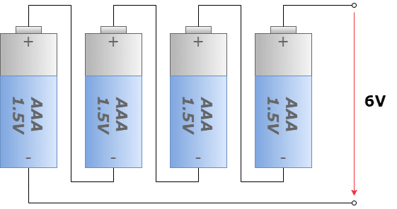
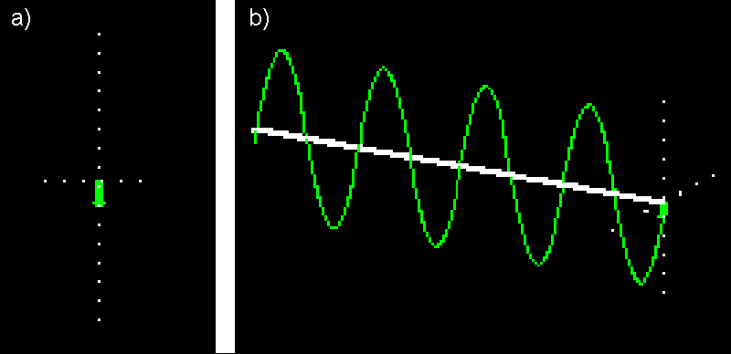
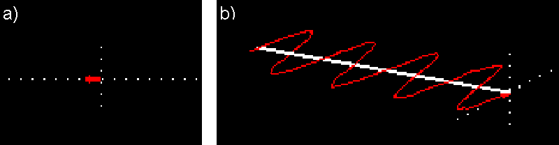
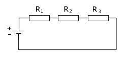
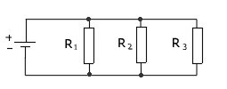

## Pytanie: 9

Link: https://botland.com.pl/blog/wp-content/uploads/2022/04/schemat-szeregowy-akku.drawio.png

Źródło: https://botland.com.pl/blog/polaczenie-rownolegle-i-szeregowe-akumulatorow/

## Pytanie: 13

Link: https://sklep.delta.poznan.pl/obrazki_art/polaryzacja_img3.gif

Źródło: https://sklep.delta.poznan.pl/polaryzacja-fali_l1_aid893.html

Link: https://sklep.delta.poznan.pl/obrazki_art/polaryzacja_img4.gif

Źródło: https://sklep.delta.poznan.pl/polaryzacja-fali_l1_aid893.html

## Pytanie 35

Link: http://www.auto-wiedza.pl/wp-content/uploads/2013/09/szereg.jpg

Źródło: https://www.auto-wiedza.pl/polaczenia-rezystorow/

## Pytanie 36

Link: http://www.auto-wiedza.pl/wp-content/uploads/2013/09/rowno.jpg

Źródło: https://www.auto-wiedza.pl/polaczenia-rezystorow/