# Materiały do egzaminu testowego na świadectwo klasy A operatora urządzeń radiowych w służbie radiokomunikacyjnej amatorskiej [2023]

## 1. Czy opór elektryczny przewodu zależy od materiału z którego jest wykonany?
A. zależy \
B. nie zależy \
C. zależy od izolacji przewodu

Odpowiedź: A. zależy

Uzasadnienie: \
Każdy materiał składa się z różnych pierwiastków, które w różny sposób budują układ krystalograficzny (dla uproszenia są to atomy tworzące kształty np. sześcianu, prostopadłościanu i inne). Z racji tego, że każdy atom pierwiastka posiada elektrony walencyjne (elektrony na ostatniej orbicie), które orbitują wokół jądra atomu, to po połączeniu wielku jąder atomów w układ, elektrony walencyjne "latają" sobie między różnymi atomami i wymieniają się miejscami. Dochodzi do tego, że te elektrony cały czas (ale tylko w obszasze oddziaływania jądek atomów!) latają od jednego jądra do drugiego. Wiele takich "latających" elektronów tworzy chmurę elektronową. 

Gdy mamy swobodne elektrony w metalu (chmura elektronowa), to po przyłożeniu różnicy potencjałów do dwóch różnych punktów tego przewodnika (podłączamy np. baterię na dwa końce przewodu), elektrony rozpoczynają dryf pod wpływem zewnętrznego pola elektrycznego w postaci uporządkowanego strumienia nośników prądu i natrafiając przypadkowo na jony (jądra atomów), będące węzłami siatki krystalicznej metalu zderzają się z nimi, tracąc pęd i energię kinetyczną. Nazywa się to oporem właściwym. 
Zderzenia te powodują hamowanie elektronów. W zależności od pierwiastków i ich struktur, tych zderzeń może być więcej lub mniej, tak więc opór elektryczny przewodu zależy od materiału (pierwiastków) z którego jest wykonany.

Referencja: \
https://zpe.gov.pl/a/prawo-ohma-i-opor-elektryczny/Da9xyUYt7

## 2. Izolatorami nazywamy materiały które:
A. nie przewodzą prądu elektrycznego \
B. przewodzą słabo \
C. przewodzą prąd przy wysokim napięciu

Odpowiedź: A. nie przewodzą prądu elektrycznego

Uzasadnienie: \
Izolatory (dielektryki) nie mają swobodnych nośników ładunku elektrycznego (elektronów lub jonów), które mogłyby się swobodnie w nich przemieszczać i przenosić ładunki elektryczne.

Referencja: \
https://zpe.gov.pl/a/przewodniki-i-izolatory-pradu-elektrycznego-przeplyw-pradu-w-przewodnikach/DnAc0NGh6

## 3. Który przewód o tej samej długości i przekroju będzie miał największą oporność?
A. wykonany z aluminium \
B. wykonany z żelaza \
C. wykonany z miedzi

Odpowiedź: B. wykonany z żelaza

Uzasadnienie: W temperaturze 20 °C: 
- Miedź:        1,72    ×   10−8 (Ω·m)
- Aluminium:    2,82    ×   10−8 (Ω·m)
- Żelazo:       10      ×   10−8 (Ω·m)

Referencja: \
https://pl.wikipedia.org/wiki/Rezystywno%C5%9B%C4%87

## 4. Który z materiałów ma własności półprzewodnikowe?
A. złoto \
B. german \
C. platyna 

Odpowiedź: B. german

Uzasadnienie: \
Żeby zrozumieć dlaczego to german ma własności półprzewodnikowe należy odpowiedzieć sobie na pytanie czym jest półprzewodnik i czym się charakteryzuje. Półprzewodnik jest materiałem, który w zależności od sytuacji ma właściwości między przewodnikiem, który ma zdolność przewodzenia elektryczności, a nieporzewodnikiem lub izolatorem, który nie pozwala na przepływ ładunków elektrycznych. Zaglądając do środka germanu widzimy, że posiada on jądro oraz 32 elektrony na czterech powłokach rozlokowanych w następujący sposób: 2, 8, 18, 4. Jak widzisz, na ostatniej powłoce są 4 elektrony (czyli 4 elektrony walencyjne). Co do zasady, sterując elektronami w ostatniej powłoce, możemy zmieniać właściwości pierwiastka. Wracając do naszych 4-ch elektronów, każdy pierwiastek chce być jak gaz szlachetny, który na ostatniej powłoce ma 8 elektronów. W tym przypadku, german również chciałby uzyskać ich 8-siem, dlatego też, gdy spotkają się dwa atomy germanu, to decydują się na współpracę i łączą się uwspólniając elektrony na powłoce walencyjnej - elektrony łączą się w 4 pary (4 wiązania kowalencyjne). W ten sposób, dzielą je ze sobą (jak w komuniźmie - wszystko wspólne) i atomy germanu są zadowolone, bo upodabniają się do gazu szlachetnego (tak jak inne pierwiastki grupy 14, które posiadają 4 elektrony walencyjne). Działa tutaj Reguła Oktetu, która jest też charakterystyczna dla półprzewodników. Złoto (1 elekron walencyjny) i platyna 1 elektron walencyny) nie mają nawet możliwości zbliżyć się do posiadania 8 elektronów walencyjnych, nawet po połączeniu z innymi atomami.

Referencja: https://pl.wikipedia.org/wiki/P%C3%B3%C5%82przewodniki
https://zpe.gov.pl/pdf/P8fuxGMuo
https://pl.wikipedia.org/wiki/Wi%C4%85zanie_kowalencyjne
_

## 5. Żarówka 12 V pobiera z baterii 0,1 A. Jaką oporność ma żarówka?
A. oporność 120 om \
B. oporność 12 om \
C. oporność 1,2 kom

Odpowiedź: A. oporność 120 om

Uzasadnienie: \
Korzystamy ze wzoru: $$ U = R \times I $$
U - napięcie [V] \
R - opór [om] \
I - natężenie [A]

Przekształacją wzór, obliczamy:

$$R = \frac{U}{I} = \frac{12[V]}{0,1[A]} = 120[om]$$

Referencja: https://pl.wikipedia.org/wiki/Rezystancja

## 6. Żarówka ma moc 24 W i pobiera z akumulatora 2 A. Jakie jest napięcie akumulatora?
A. napięcie wynosi 24 V \
B. napięcie wynosi 12 V \
C. napięcie wynosi 48 V

Odpowiedź: B. napięcie wynosi 12 V

Uzasadnienie:
W tym przypadku widzimy, że mamy znaną moc 24[W] oraz natężenie 2[A], a szukamy napięcia. Korzystamy więc ze wzoru na moc 
$$
P = U \times I
$$
P - moc elektryczna [W] \
U - napięcie [V] \
I - natężenie [A]

Przekształcając wzór, obliczamy:
$$
U = \frac{P}{I} = \frac{24[W]}{2[A]} = 12[V].
$$

Referencja:
https://pl.wikipedia.org/wiki/Moc_elektryczna

## 7. Źródła chemiczne prądu dają prąd:
A. stały \
B. zmienny \
C. pulsujący

Odpowiedź: A. stały

Uzasadnienie: \
Baterie generują prąd stały (DC) z powodu sposobu, w jaki zachodzi reakcja chemiczna wewnątrz nich. W baterii zachodzi proces redoks (utlenianie i redukcja), gdzie jeden materiał (anoda) oddaje elektrony, a drugi materiał (katoda) przyjmuje elektrony. Elektrony przepływają od anody do katody przez zewnętrzny obwód, tworząc prąd stały.

Podczas tej reakcji chemicznej w baterii, materiały elektrody i elektrolit są tak dobrane, aby wymuszać przepływ elektronów w jednym kierunku. Elektrony nie mogą wracać do anody przez elektrolit, co powoduje, że prąd w zewnętrznym obwodzie ma stały kierunek. Właśnie dlatego baterie wytwarzają prąd stały, a nie zmienny.

Dodatkowo, prąd zmienny (AC) wymaga mechanizmu, który zmienia kierunek przepływu elektronów w regularnych odstępach czasu, co w bateriach nie ma miejsca z powodu braku ruchomych części i specyfiki reakcji chemicznej.

Referencja: \
https://pl.wikipedia.org/wiki/Pr%C4%85d_sta%C5%82y

## 8. Akumulator ma pojemność 20 Ah. Jak długo będzie świecić z niego żarówka pobierająca 4 A?
A. 5 godzin \
B. 4 godziny \
C. 80 godzin

Odpowiedź: A. 5 godzin

Uzasadnienie:
Aby obliczyć, jak długo będzie świecić żarówka pobierająca 4 A z akumulatora o pojemności 20 Ah, można użyć prostego wzoru:

$$
\text{Czas świecenia (w godzinach)} = \frac{\text{Pojemność akumulatora (Ah)}}{\text{Pobór prądu przez żarówkę[A]}} = \frac{20[Ah]}{4[A]} = 5[h]
$$

Referencja: Brak

## 9. Ile bateryjek 4,5 V potrzebujemy połączyć w szereg, by uzyskać baterię anodową o napięciu 90 V?
A. 15 szt. \
B. 10 szt. \
C. 20 szt.

Odpowiedź: C. 20 szt.

Uzasadnienie:
W celu uzyskania wyższego napięcia w tym przypadku 90[V] korzystając z bateryjek o napięciu 4,5[V], należy połączyć je szeregowo. Połączenie szeregowe powoduje sumowanie się wartości napięcia każdego pojedynczego elementu.

Korzystając z tej zależności, można skorzystać ze wzoru:

$$
\text{Ilość baterii} \times 4,5[V] = 90[V]
$$
$$
\text{Ilość baterii} = \frac{90[V]}{4,5[V]} = 20
$$

Referencja:
https://botland.com.pl/blog/polaczenie-rownolegle-i-szeregowe-akumulatorow/

## 10. Ładunki elektryczne w przestrzeni przyciągają się jeżeli:
A. są jednoimienne \
B. są różnoimienne \
C. są daleko

Odpowiedź: B. są różnoimienne

Uzasadnienie: \
Ładunki elektryczne przyciągają się, jeśli są różnoimiennymi, czyli mają przeciwne znaki: dodatni przyciąga ujemny. Zasada ta wynika z prawa elektrostatyki, które opisuje zachowanie się ładunków elektrycznych w przestrzeni. Jako przykład można przytoczyć pocieranie balonu o sweter. 

Przy pocieraniu balonu o sweter dochodzi do transferu ładunków elektrycznych między nimi. Proces ten jest efektem tarcia dwóch powierzchni, co powoduje przemieszczanie się ładunków na poziomie mikroskopowym. Oto jak to działa:

1. Transfer elektronów: Podczas pocierania, elektrony mogą przemieszczać się z jednego ciała na drugie. Na przykład, jeśli pocierasz balon o sweter, to elektrony mogą być transferowane z atomów jednego materiału do atomów drugiego materiału.

2. Zmiany w ładunkach: Jeśli balon ma tendencję do tracenia elektronów (staje się dodatnio naładowany), to sweter zyskuje te elektrony (staje się ujemnie naładowany). Zmiany te są związane z zachowaniem ładunków w obwodach elektrycznych.

3. Efekt elektrostatyczny: Po pocieraniu balonu o sweter, mogą występować siły elektrostatyczne między nimi, co może prowadzić do przyciągania lub odpychania się, w zależności od tego, czy ładunki są różnoimiennymi lub jednoimiennymi.

Atomy same w sobie nie zmieniają swojego jądra atomowego podczas takich procesów. Transfer ładunków elektrycznych zachodzi na poziomie elektronów, które mogą opuszczać lub dołączać do atomów, zmieniając tym samym naładowanie materiałów.

Referencja: \
https://zpe.gov.pl/a/ladunki-elektryczne-i-ich-oddzialywanie-ladunek-elementarny/DBx973brI

## 11. Materiały ferromagnetyczne to materiały które przewodzą pole magnetyczne:
A. lepiej niż powietrze \
B. tak jak powietrze \
C. gorzej niż powietrze

Odpowiedź: A. lepiej niż powietrze

Uzasadnienie: \
Pole magnetyczne powstaje w wyniku ruchu ładunków elektrycznych i można je zdefiniować jako obszar wokół magnesu, w którym odczuwalny jest wpływ magnetyzmu. Jest to pole siłowe, które oddziałuje na materiały, takie jak żelazo, znajdujące się w jego pobliżu.

Pole magnetyczne nie wymaga propagacji w ośrodku i może istnieć nawet w próżni. Ma większą zdolność magazynowania energii niż pole elektryczne, co czyni je niezwykle użytecznym w elektromechanicznych urządzeniach, takich jak transformatory, silniki i generatory.

Pole magnetyczne może być wytwarzane nie tylko przez magnes, ale także przez poruszający się ładunek lub prądy elektryczne. Atomy składające się na materię posiadają jądro, w którym znajdują się protony i neutrony, a wokół jądra krążą elektrony. Pole magnetyczne powstaje w wyniku rotacji i wirowania protonów i neutronów lub jądra atomu. Kierunek pola magnetycznego jest określony przez kierunki orbity i rotacji. Pole magnetyczne jest reprezentowane matematycznie przez literę "B", a jednostką jego siły jest tesla (T).

Powietrze jest słabym przewodnikiem pola magnetycznego z kilku powodów:

1. Niska gęstość elektronów: Powietrze jest gazem, którego atomy i cząsteczki mają niewielką gęstość elektronów. Aby materiał dobrze przewodził pole magnetyczne, musi mieć duże ilości ruchomych ładunków elektrycznych, które mogą reagować na pole magnetyczne.

2. Mała przenikalność magnetyczna: Przenikalność magnetyczna określa zdolność materiału do reagowania na pole magnetyczne. Powietrze ma niską przenikalność magnetyczną w porównaniu do materiałów ferromagnetycznych, co oznacza, że pola magnetyczne przenikają przez powietrze słabiej.

3. Brak struktury domenowej: Materiały ferromagnetyczne mają unikalną strukturę zwanych domenami magnetycznymi, które ustawiają się wzdłuż jednej osi. To że Przeszku który wie domowej

Porównanie ilości elektronów, które "przenoszą" pole magnetyczne:
1. Powietrze:

    1.1. Masa powietrza w $1m^3$ = 1.225[kg]

    1.2. Skład powietrza:
    - $Azot (N_2)$: 78%

    - $Tlen (O_2)$: 21%

    - $Argon (Ar)$: 0.93%

    - $\text{Inne gazy}: 0.07%$

    1.3 Masa składników w $1m^3$ powietrza:
    - $Azot (N_2): 0.78 \times 1.225[kg] = 0.9555[kg]$

    - $Tlen: (O_2): 0.21 \times 1.225[kg] = 0.25725[kg]$

    - $Argon (Ar): 0.0093 \times 1.225[kg] = 0.0113925[kg]$

    - $\text{Inne gazy}: 0.0007 \times 1.225[kg] = 0.0008575[kg]$
    
    1.4. Masa molowa:
    - $Azot (N_2): 28 \frac{g}{mol} = 0.028\frac{kg}{mol}$

    - $Tlen (O_2): 32 \frac{g}{mol} = 0.032\frac{kg}{mol}$

    - $Argon (Ar): 40 \frac{g}{mol} = 0.040\frac{kg}{mol}$

    1.5. Liczba moli w $1m^3$ powietrza:
    - $Azot (N_2): \frac{0.9555[kg]}{0.028\frac{kg}{mol}} = 34.125[mol]$

    - $Tlen (O_2): \frac{0.25725[kg]}{0.032\frac{kg}{mol}} = 8.038[mol]$

    - $Argon (Ar): \frac{0.0008575[kg]}{0.040\frac{kg}{mol}} = 0.285[mol]$

    1.6. Liczba cząsteczek:
    - $\text{Liczba Avogardro}: 6.022 \times 10^{23} \frac{cząsteczek}{mol}$

    - $Azot (N_2): 34.125[mol] \times 6.022 \times 10^{23}\frac{cząsteczek}{mol} = 2.055 \times 10^{25}[cząsteczek]$

    - $Tlen (O_2): 8.038[mol] \times 6.022 \times 10^{23}\frac{cząsteczek}{mol} = 4.837 \times 10^{24}[cząsteczek]$

    - $Argon (Ar): 0.285[mol] \times 6.022 \times 10^{23}\frac{cząsteczek}{mol} = 1.716 \times 10^{23}[cząsteczek]$

    1.7. Liczba elektronów walencyjnych na powłoce:
    - $Azot (N): \text{5 elektronów walencyjnych}$
    - $Azot (N_2): \text{10 elektronów walencyjnych na cząsteczkę}$
    - $Tlen (O): \text{6 elektronów walencyjnych}$
    - $Tlen (O_2): \text{12 elektronów walencyjnych na cząsteczkę}$
    - $Argon (Ar): \text{8 elektronów walencyjnych na cząsteczkę}$

    1.8. Liczba elektronów walencyjnych:
    - $Azot (N_2): 2.055 \times 10^{25}[cząsteczek] \times 10\frac{e^{-}}{cząsteczek} = 2.055 \times 10^{26}[e^{-}]$

    - $Tlen (O_2): 4.837 \times 10^{24}[cząsteczek] \times 12\frac{e^{-}}{cząsteczek} = 5.804 \times 10^{25}[e^{-}]$

    - $Argon (Ar): 1.716 \times 10^{23}[cząsteczek] \times 8\frac{e^{-}}{cząsteczek} = 1.373 \times 10^{24}[e^{-}]$

    1.9. Suma elektronów walencyjnych:\
    $2.055 \times 10^{26}[e^{-}] + 5.804 \times 10^{25}[e^{-}] + 1.373 \times 10^{24}[e^{-}] = 2.698 \times 10^{26}[e^{-}]$

2. Żelazo (ferromagnetyw):
    1.1. Masa żelaza w $1m^3$ = 7874[kg]
   
    1.2. Masa molowa:
    - $Żelazo (Fe): 55.845 \frac{g}{mol} = 0.0055845\frac{kg}{mol}$

    1.3. Liczba moli w $1m^3$ żelaza:
    - $Żelazo (Fe): \frac{7874[kg]}{0.0055845\frac{kg}{mol}} = 140.997[mol]$

    1.4. Liczba cząsteczek (atomów):
    - $\text{Liczba Avogardro}: 6.022 \times 10^{23} \frac{cząsteczek}{mol}$

    - $Żelazo (Fe): 140.997[mol] \times 6.022 \times 10^{23}\frac{cząsteczek}{mol} = 8.49 \times 10^{28}[cząsteczek]$

    1.5. Liczba elektronów walencyjnych na powłoce:
    - $Żelazo (Fe): \text{2 elektrony walencyjne}$

    1.6. Liczba elektronów walencyjnych:
    - $Żelazo (Fe)): 8.49 \times 10^{28}[cząsteczek] \times 2\frac{e^{-}}{cząsteczek} = 1.698 \times 10^{29}[e^{-}]$

3. Podsumowanie:
    - $Powietrze: 2.698 \times 10^{26}\frac{\text{elektronów walencyjnych}}{m^3}$
    - $Żelazo: 1.698 \times 10^{29}\frac{\text{elektronów walencyjnych}}{m^3}$

Wniosek:
Żelazo posiada o trzy rzędy wielkości więcej elektronów walencyjnych od powietrza, tak więc jednoczeście lepiej będzie się zachowywać pod kątem przenoszenia pola magnetycznego (czyli pola wytwarzanego przez poruszaące się elektrony - bo jest ich więcej).

Referencja: \
https://pl.wikipedia.org/wiki/G%C4%99sto%C5%9B%C4%87_powietrza \
https://pl.webqc.org/molecular-weight-of-N2.html \
https://pl.webqc.org/molecular-weight-of-O2.html \
https://pl.wikipedia.org/wiki/%C5%BBelazo \
https://pl.webqc.org/molecular-weight-of-Fe.html \
https://teoriaelektryki.pl/niezwykly-ferromagnetyzm/
https://dhit.pl/blog/pole-magnetyczne/
https://pl.periodic-table.io/element-7
https://pl.periodic-table.io/element-8
https://pl.periodic-table.io/element-18
https://pl.periodic-table.io/element-26

## 12. Jaki kierunek przyjmuje pole magnetyczne wokół przewodnika z prądem?
A. jest prostopadłe do przewodu
B. jest do niego równoległe
C. jest ukośne do przewodu

Odpowiedź: A. jest prostopadłe do przewodu

Uzasadnienie: \
Jest to zasada określona przez prawo Ampère'a, które mówi, że pole magnetyczne generowane przez przewodnik z prądem ma kierunek okrężny i jest prostopadłe do kierunku przepływu prądu. Jeśli prąd płynie w przewodniku, linie pola magnetycznego tworzą zamknięte pętle wokół przewodnika, a ich kierunek jest prostopadły do przewodnika.

Referencja: \
https://home.agh.edu.pl/~kakol/efizyka/w23/main23a.html

## 13. Jeżeli składowa elektryczna fali jest prostopadła do ziemi to fala ma polaryzację?
A. poziomą
B. pionową
C. kołową

Odpowiedź: B. pionową

Uzasadnienie:
W przypadku wiązki fal elektromagnetycznych biegnących poziomo, jeśli zaburzenia pola elektrycznego oscylują w kierunku prostopadłym do powierzchni Ziemi, mowa jest o polaryzacji pionowej V (z ang. vertical), oznaczanej jako wektor EV.

Jeśli zaś oscylacje wektora występują w kierunku równoległym do powierzchni Ziemi, to jest to polaryzacja pozioma H (z ang. horizontal), oznaczana jako wektor EH.

Referencja: \
https://sklep.delta.poznan.pl/polaryzacja-fali_l1_aid893.html

## 14. Czy prędkość fali elektromagnetycznej zależy od ośrodka w którym się rozchodzi?
A. tak \
B. nie zależy \
C. jest zawsze jednakowa

Odpowiedź: A. tak

Uzasadnienie: \
Prędkość rozchodzenia się fali elektromagnetycznej zależy od ośrodka, w jakim porusza się ta fala i osiąga wielkość maksymalną w próżni. W ośrodkach materialnych (np. powietrze, woda, szkło) prędkość rozchodzenia się fali elektromagnetycznej jest mniejsza niż w próżni. To zmniejszenie prędkości jest spowodowane interakcjami fali elektromagnetycznej z cząsteczkami materiału.

Referencja: \
https://pl.wikipedia.org/wiki/Pr%C4%99dko%C5%9B%C4%87_%C5%9Bwiat%C5%82a

## 15. Długość fali wynosi 1500 metrów. Jaka jest częstotliwość tej fali?
A. 2 MHz \
B. 200 kHz \
C. 233 kHz

Odpowiedź: B. 200 kHz

Uzasadnienie:
Korzystając ze wzoru na drogę w ruchu jednostajnym, możemy zapisać, że $droga = prędkość \times czas$, czyli
$$
λ = v \times T \\
$$
λ - długość fali \
v - prędkość fali w ośrodku, tutaj prędkość światła w próżni \
T - okres, który jest odwotnością częstotliwośc $T = \frac{1}{f}$

$$
λ = v \times T = v \times \frac{1}{f} = \frac{v}{f} = \frac{300000[\frac{m}{s}]}{1500[m]} = 200[kHz]
$$

Referencja: \
https://zpe.gov.pl/a/stosowanie-zaleznosci-miedzy-okresem-i-czestotliwoscia-oraz-predkoscia-i-dlugoscia-fal-w-obliczeniach/DYEL63xVP

## 16. Jaki zakres częstotliwości dźwięków wystarcza dla zrozumiałego nadawania mowy?

A. od 300 Hz do 3,2 kHz \
B. od 100Hz do 5 kHz \
C. od 20 Hz do 15 kHz

Odpowiedź: A. od 300 Hz do 3,2 kHz

Uzasadnienie: \
W telefonii użyteczne pasmo częstotliwości głosu wynosi od około 300 do 3400 Hz. Z tego powodu pasmo ultra niskich częstotliwości widma elektromagnetycznego między 300 a 3000 Hz jest również określane jako częstotliwość głosu, będąc energią elektromagnetyczną, która reprezentuje energię akustyczną w paśmie podstawowym.

Chociaż podstawowe częstotliwości głosów mężczyzn (około 85-180 Hz) i kobiet (około 165-255 Hz) leżą poniżej 300 Hz, ich harmoniczne są znacznie wyższe i mieszczą się w zakresie od 300 Hz do 3,4 kHz.

Referencja:\
https://en.wikipedia.org/wiki/Voice_frequency

## 17. Nadajnik UKF ma kwarc kanałowy 12 MHz. Ile razy musi być powielony, by uzyskać 144 MHz?
A. 16 razy \
B. 12 razy \
C. 18 razy

Odpowiedź: B. 12 razy

Uzasadnienie: \
Aby określić, ile razy częstotliwość 12 MHz musi być powielona, by uzyskać 144 MHz, można skorzystać z prostego wzoru matematycznego:

$$
Liczba powielania = \frac{\text{Docelowa częstotliwość}}{\text{Częstotliwość kwarcu}}
$$ 

W tym przypadku:

$$
\text{Liczba powielania} = \frac{144[MHz]}{12[MHz]} = 12
$$

Referencja:
Brak

## 18. Modulacja telegraficzna CW polega na:
A. przerywaniu fali nośnej \
B. zmianie jej częstotliwości \
C. zmianie jej amplitudy

Odpowiedź: A. przerywaniu fali nośnej

Uzasadnienie: \
Modulacja telegraficzna CW (ang. continuous wave lub continuous waveform) to najprostsza forma modulacji używana w telegrafii radiowej.
Polega na włączaniu i wyłączaniu fali nośnej w regularnych odstępach czasu, co odpowiada kodowi Morse'a (kropki i kreski).
Fala nośna jest przerywana, aby przekazać informacje w postaci impulsów, które są odbierane jako sygnały dźwiękowe w odbiorniku CW.

Referencja: \
https://pl.wikipedia.org/wiki/CW

## 19. Kanał radiowy nadajnika telegraficznego CW jest:
A. bardzo szeroki \
B. bardzo wąski \
C. średni

Odpowiedź: B. bardzo wąski

Uzasadnienie: \
Modulacja telegraficzna CW (Continuous Wave) używa bardzo wąskiego pasma częstotliwości.
Ponieważ CW polega na prostym włączaniu i wyłączaniu fali nośnej bez modulacji amplitudy, częstotliwości czy fazy, szerokość pasma zajmowanego przez taki sygnał jest minimalna.
Typowy sygnał CW ma szerokość pasma około kilku Hz do kilkudziesięciu Hz, co jest bardzo wąskim kanałem w porównaniu do innych rodzajów modulacji, takich jak AM czy FM.

Referencja:
https://en.wikipedia.org/wiki/Continuous_wave

## 20. Przy modulacji częstotliwości FM szerokość kanału radiowego dla nadajników amatorskich UKF wynosi:
A. 12,5 kHz \
B. 50 kHz \
C. 200 kHz

Odpowiedź: A. 12,5 kHz

Uzasadnienie: \
W amatorskich pasmach radiowych UKF (np. pasmo 2 metry), szerokość kanału dla wąskopasmowej modulacji częstotliwości FM (NFM) jest często ustawiana na 12,5 kHz lub 25 kHz, w zależności od lokalnych przepisów i standardów.
Szerokość kanału 12,5 kHz jest często stosowana w nowoczesnych systemach FM w celu efektywniejszego wykorzystania dostępnego spektrum.

Referencja: \
http://sp7pki.iq24.pl/default.asp?grupa=162750&temat=128613

## 21. Jaka jest szerokość kanału radiowego przy emisji SSB?
A. 9 kHz \
B. 3,5 kHz \
C. 1,5 kHz

Odpowiedź: B. 3,5 kHz

Uzasadnienie: \
SSB (Single Sideband) jest to technika modulacji używana w radiokomunikacji, która jest odmianą modulacji amplitudowej (AM). W tradycyjnej modulacji AM, sygnał zawiera nośną oraz dwie wstęgi boczne: górną (USB - Upper Sideband) i dolną (LSB - Lower Sideband). W SSB jedna z tych wstęg bocznych jest usuwana, a sygnał nośny jest redukowany lub całkowicie usuwany. Dzięki temu SSB jest bardziej efektywne pod względem wykorzystania pasma i mocy.

W tradycyjnej modulacji AM, pełne pasmo sygnału zawiera nośną i dwie wstęgi boczne, co daje szerokość pasma około 6 kHz dla sygnału mowy (po 3 kHz dla każdej wstęgi bocznej). W SSB usuwana jest jedna wstęga boczna i nośna, pozostawiając tylko jedną wstęgę boczną o szerokości 3 kHz.

"Eliminacja nośnej i jednej wstęgi bocznej (z których żadna nie jest 
która nie jest niezbędna do transmisji danych wywiadowczych) pozwala na zmniejszenie szerokości pasma do 2800 Hz"

Referencja:
https://www.arrl.org/files/file/ARRL%20Handbook%20Supplemental%20Files/2021%20Edition/C_F4Web.pdf

## 22. Amatorska telewizja z powolnym analizowaniem SSTV może być stosowana do łączności prowadzonych:
A. na duże odległości na falach krótkich \
B. tylko na UKF \
C. tylko w internecie

Odpowiedź: A. na duże odległości na falach krótkich

Uzasadnienie:

SSTV - Slow Scan Television -  analogowa technika przesyłania nieruchomych obrazów, wykorzystywana głównie w łączności amatorskiej w pasmach fal krótkich i ultrakrótkich

1. SSTV na Falach Krótkich (HF): \
SSTV jest często używana w paśmie fal krótkich (HF), które są znane z możliwości odbijania się od jonosfery, co umożliwia komunikację na duże odległości. Fale krótkie obejmują zakres częstotliwości od 3 MHz do 30 MHz.
Przykładowe Częstotliwości: Popularne częstotliwości dla SSTV to 14.230 MHz, 14.233 MHz i 14.236 MHz w paśmie 20 metrów​ (Ham Universe)​ .

2. SSTV na UKF (VHF): \
Choć SSTV może być używana w paśmie UKF, jej zastosowanie w tym zakresie jest bardziej ograniczone do lokalnych łączności ze względu na charakterystykę propagacji fal VHF, które są bardziej ograniczone przez horyzont i mniej efektywne na duże odległości w porównaniu do fal krótkich​.

3. SSTV w Internecie: \
Choć Uzasadnienie SSTV mogą być przesyłane przez Internet, to nie jest to główny sposób użycia tej technologii. SSTV jest przede wszystkim używana w radiokomunikacji amatorskiej, gdzie nadawane Uzasadnienie są odbierane przez stacje radiowe na falach radiowych​.

Referencja: \
https://pl.wikipedia.org/wiki/SSTV

## 23. Która z podanych mocy PEP odpowiada napięciu maksymalnemu U max = 100 V, zmierzonemu oscyloskopem na wyjściu nadajnika, na obciążeniu 50 om?
A. 200 W \
B. 100 W \
C. 50 W

Odpowiedź: B. 100 W

Uzasadnienie: \
Peak Envelope Power (PEP), czyli moc szczytowa obwiedni, to pojęcie używane w radiokomunikacji do opisania maksymalnej mocy wyjściowej nadawcy podczas pełnego cyklu sygnału modulowanego. PEP jest szczególnie istotna w systemach modulacji amplitudy (AM) oraz w modulacji jednowstęgowej (SSB - Single Sideband Modulation).

PEP można obliczyć na podstawie maksymalnego napięcia (U_max) zmierzonego na wyjściu nadajnika oraz impedancji obciążenia (R) za pomocą następującego wzoru:

$$
PEP = \frac{{U_{max}}^2}{2R} = \frac{100^2[V]}{2 \times 50[om]} = \frac{10000[V]}{100[om]} = 100[W]
$$

Referencja: \
https://pl.wikipedia.org/wiki/Peak_envelope_power

## 24. Opornik warstwowy metalizowany jest wykonany jako:
A. metalowa warstwa oporowa na wałku ceramicznym \
B. warstwa drutu oporowego nawiniętego na wałku ceramicznym \
C. warstwa oporowa węglowa na wałku ceramicznym

Odpowiedź: A. metalowa warstwa oporowa na wałku ceramicznym

Uzasadnienie: \
Opornik warstwowy metalizowany jest wykonany przez nałożenie cienkiej warstwy metalu na ceramiczny wałek. Metalowa warstwa działa jako materiał oporowy, który kontroluje przepływ prądu elektrycznego. Wałek ceramiczny jest używany jako podłoże, ponieważ jest trwały i odporny na wysokie temperatury.

Dlaczego nie B lub C?

- B. warstwa drutu oporowego nawiniętego na wałku ceramicznym: Ta opcja opisuje opornik drutowy, a nie warstwowy metalizowany. Oporniki drutowe mają drut nawinięty na ceramiczny wałek, ale to inna technologia.\
- C. warstwa oporowa węglowa na wałku ceramicznym: Ta opcja opisuje opornik węglowy, a nie metalizowany. Oporniki węglowe mają warstwę węgla jako materiał oporowy, ale to inna technologia.

Referencja: \
https://pl.wikipedia.org/wiki/Rezystor_warstwowy

## 25. Do cewki powietrznej 100 uH wkładamy rdzeń ferrytowy o względnej przenikalności μ=10. Ile wyniesie indukcyjność cewki?
A. wzrośnie do 1000 $μH$ \
B. nie zmieni się \
C. zmaleje do 10 $μH$

Odpowiedź: A. wzrośnie do 1000 $μH$

Uzasadnienie: \
Kiedy wkładamy rdzeń ferrytowy do cewki, zmienia się jej indukcyjność w zależności od względnej przenikalności magnetycznej materiału rdzenia.

Indukcyjność cewki ($L$) jest proporcjonalna do przenikalności magnetycznej ($μ_r$). Gdy do cewki powietrznej wkładamy rdzeń ferrytowy, indukcyjność cewki wzrasta. Indukcyjność nowej cewki z rdzeniem ferrytowym można obliczyć za pomocą następującego wzoru:

$$
L_{rdzeń} = L_{powietrze} \times μ_r = 100μH \times 10 = 1000 μH
$$

Referencja:\
http://fiona.dmcs.p.lodz.pl/npe/NPE2.pdf [Cewki z rdzeniem]

## 26. Są dwie cewki powietrzne. Przy tej samej średnicy i ilości zwojów, L1 jest nawinięta drutem dwa razy grubszym niż L2. Która z nich ma większą dobroć Q?
A. cewka L2
B. cewka L1
C. obie mają taką samą dobroć, bo mają tą samą średnicę

Odpowiedź: B. cewka L1

Uzasadnienie: \
Dobroć Q (Quality factor) cewki lub obwodu rezonansowego jest miarą wydajności i efektywności w magazynowaniu energii w stosunku do strat energii. Jest to bezwymiarowa wielkość, która pokazuje, jak dobrze obwód rezonansowy przechowuje energię oscylującą w porównaniu do energii traconej w postaci ciepła.

Dobroć Q jest istotna w projektowaniu filtrów, obwodów rezonansowych, cewek i kondensatorów używanych w radiotechnice i elektronice.

Znaczenie Dobroci Q
- Wysoka dobroć Q oznacza, że obwód jest bardziej efektywny w przechowywaniu energii i ma mniejsze straty.
- Niska dobroć Q wskazuje, że obwód ma większe straty energii i jest mniej efektywny.

Analiza:

1. Grubość drutu:
- Cewka L1 jest nawinięta drutem, który jest dwa razy grubszy niż drut użyty do cewki L2.
- Grubszy drut ma mniejszą rezystancję (rezystancja drutu maleje wraz ze wzrostem jego przekroju poprzecznego).
2. Rezystancja:
- Ponieważ grubszy drut (L1) ma mniejszą rezystancję, straty w cewce L1 będą mniejsze niż w cewce L2.
3. Indukcyjność:
- Przy tej samej średnicy i liczbie zwojów, indukcyjność obu cewek będzie taka sama.
4. Dobroć Q:
- Mniejsza rezystancja w cewce L1 oznacza większą wartość $𝑄$ według wzoru $Q = \frac{2\pi fL}{R}$, gdzie:
    - $f$ to częstotliwość pracy,
    - $L$ to indukcyjność cewki,
    - $R$ to rezystancja strat cewki.

- Dlatego cewka L1 będzie miała większą dobroć Q niż cewka L2.

Referencja:\
http://e-learning.prz.edu.pl/pluginfile.php/120885/mod_resource/content/1/Podst_Metrol_W14_22_pomiary_impedancji.pdf [Przykłady pomiar parametrów RLC metodą techniczną 1]

## 27. Przekładnia transformatora wynosi 20 do 1. Strona pierwotna włączona jest na napięcie sieci 240 V. Jakie napięcie będzie po stronie wtórnej?
A. 24 V \
B. 12 V \
C. 20 V

Uzasadnienie:
Przekładnią zwojową transformatora nazywamy stosunek liczby zwojów uzwojenia pierwotnego do liczby zwojów uzwojenia wtórnego. Przekładnię tą oznaczamy najczęściej literą grecką 
${\eta}$ lub $\vartheta _{z}$

Dla transformatorów jednofazowych przyjmujemy, że
$$
\vartheta _{z} = \frac{z_1}{z_2} = \frac{U_{i1}}{U_{i2}}
$$
Gdzie: \
    - $z_1$ - liczba zwojów uzwojenia pierwotnego \
    - $z_2$ - liczba zwojów uzwojenia wtórnego \
    - $U_{i1}$ - wartość skuteczna napięcia sinusoidalnego indukowanego w uzwojeniu pierwotnym \
    - $U_{i2}$ - wartość skuteczna napięcia sinusoidalnego indukowanego w uzwojeniu wtórnym

W naszym przypadku należy podstawić wartości do wzoru i obliczyć $U_{i2}$ (można skorzystać z proporcji):

$$ \frac{z_1}{z_2} = \frac{U_{i1}}{U_{i2}} $$

$$ {U_{i2}} = \frac{{U_{i1} \times z_2}}{z_1} = \frac{240[V] \times 1}{20} = \frac{240[V]}{20} = 12[V]$$

Referencja:
https://pl.wikipedia.org/wiki/Przek%C5%82adnia_transformatora

## 28. Diody prostownicze zasilające są stosowane do:
A. prostowania prądów wysokiej częstotliwości \
B. do prostowania prądu w zasilaczach \
C. do stabilizacji napięć

Odpowiedź: B. do prostowania prądu w zasilaczach

Uzasadnienie: \
Głównym zadaniem diody prostowniczej jest prostowanie prądu, czyli konwersja prądu przemiennego (AC) na prąd stały (DC). Jest używana głównie w zasilaczach do prostowania napięcia.

Charakterystyka:
- Przewodzi prąd w jednym kierunku (od anody do katody) i blokuje przepływ prądu w kierunku przeciwnym.
- Ma niski spadek napięcia w kierunku przewodzenia (zazwyczaj około 0.7 V dla diody krzemowej).
- Nie jest zaprojektowana do pracy w zakresie napięć ujemnych w kierunku przewodzenia (niskie napięcie przebicia w kierunku wstecznym).

Zastosowania:
- Zasilacze
- Mostki prostownicze
- Obwody zabezpieczające

Referencja:\
https://botland.com.pl/blog/dioda-prostownicza-co-to-jest-zasada-dzialania-i-zastosowanie/

## 29. Diody Zenera to diody do:
A. stabilizacji napięć \
B. świecące \
C. na bardzo wysokie częstotliwości

Odpowiedź: A. stabilizacji napięć

Uzasadnienie:
Dioda Zenera jest używana do stabilizacji napięcia w obwodach. Dodatkowo, może przewodzić prąd w kierunku wstecznym, kiedy napięcie przekroczy wartość napięcia Zenera.

Charakterystyka:
- Pracuje zarówno w kierunku przewodzenia, jak i w kierunku wstecznym po przekroczeniu napięcia Zenera.
- Napięcie Zenera to napięcie, przy którym dioda zaczyna przewodzić prąd w kierunku wstecznym. Jest ono stałe i dobrze określone, co umożliwia stabilizację napięcia.
- W kierunku przewodzenia działa jak zwykła dioda prostownicza.

Zastosowania:
- Stabilizatory napięcia
- Ograniczniki napięcia
- Obwody zabezpieczające przed przepięciami

Referencja: \
https://pl.wikipedia.org/wiki/Dioda_Zenera \
https://botland.com.pl/73-diody-zenera

## 30. Warikap to dioda:
A. dioda mikrofalowa \
B. dioda pojemnościowa \
C. dioda stabilizacyjna

Odpowiedź: B. dioda pojemnościowa

Uzasadnienie:\
Dioda pojemnościowa to specjalny typ diody półprzewodnikowej, której pojemność zmienia się w zależności od napięcia przyłożonego w kierunku wstecznym.
Wyróżnia się dwa rodzaje diód pojemnościowych:
- warikapy (od ang. variable capacitance, zmienna pojemność), o pojemności 10–500 pF, używane głównie w układach automatycznego strojenia jako elementy obwodów rezonansowych,
- waraktory (od ang. variable reactance, zmienna reaktancja), o pojemności 0,2–20 pF, używane głównie w zakresie wysokich częstotliwości, jak również mikrofalowym (5–200 GHz); znajdują zastosowanie na przykład w powielaczach częstotliwości.

Dioda pojemnościowa jest powszechnie stosowana w strojeniu obwodów rezonansowych, szczególnie w odbiornikach radiowych. Jej główną rolą jest zmiana pojemności w odpowiedzi na zmiany napięcia, co pozwala na precyzyjne dostrojenie częstotliwości obwodów rezonansowych.

Jak to działa w radiu?

1. Obwód rezonansowy:\
W klasycznym odbiorniku radiowym istnieje obwód rezonansowy składający się z cewki (L) i kondensatora (C). Cewka i kondensator tworzą układ LC, który ma swoją częstotliwość rezonansową. Ta częstotliwość jest zależna od wartości indukcyjności i pojemności.

2. Rola diody pojemnościowej:\
Dioda pojemnościowa zastępuje kondensator lub jest podłączona równolegle do kondensatora w obwodzie rezonansowym. Jej pojemność zmienia się w zależności od napięcia przyłożonego w kierunku wstecznym.
Zmieniając napięcie przyłożone do diody pojemnościowej, zmienia się jej pojemność, co z kolei zmienia częstotliwość rezonansową obwodu LC.

3. Strojenie radia:\
W praktyce, pokrętło strojenia radia jest połączone z potencjometrem lub cyfrowym kontrolerem, który zmienia napięcie przyłożone do diody pojemnościowej.
Zmieniając to napięcie, dioda pojemnościowa zmienia swoją pojemność, dostrajając obwód LC do częstotliwości żądanej stacji radiowej. Dzięki temu użytkownik może płynnie dostroić się do różnych stacji radiowych.

Przykład:
1. Analogowy odbiornik radiowy:\
W analogowych odbiornikach radiowych, kiedy użytkownik obraca pokrętłem strojenia, napięcie przyłożone do diody pojemnościowej zmienia się, co powoduje zmianę pojemności diody.
Na przykład, aby dostroić radio do częstotliwości 100 MHz, napięcie na diodzie pojemnościowej jest ustawiane w taki sposób, że obwód rezonansowy (LC) ma rezonans przy 100 MHz.

2. Cyfrowy odbiornik radiowy:\
W cyfrowych odbiornikach radiowych mikroprocesor kontroluje napięcie przyłożone do diody pojemnościowej, co umożliwia precyzyjne i szybkie strojenie do wybranych częstotliwości przez użytkownika.

Referencja:\
https://ewektor.pl/dioda-pojemnosciowa-warikapowa-co-to-jest-i-jakie-ma-zastosowanie/ \
https://pl.wikipedia.org/wiki/Dioda_pojemno%C5%9Bciowa

## 31. Z jakich pierwiastków wykonywane są tranzystory i obwody scalone?
A. z absolutnie czystego krzemu i germanu \
B. z czystego krzemu i germanu z domieszkami boru i arsenu \
C. z krzemu i tlenków krzemu

Odpowiedź: B. z czystego krzemu i germanu z domieszkami boru i arsenu.

Uzasadnienie:\
Dziś najpopularniejszym materiałem półprzewodnikowym jest krzem, o symbolu chemicznym Si (ang. silicon), który jest domieszkowany takimi pierwiastkami jak bor, fosfor, glin, arsen, antymon. Oprócz krzemu istnieje też mnóstwo innych materiałów półprzewodnikowych, jak pierwiastek german (Ge) oraz proste związki chemiczne, z których najpopularniejsze są arsenek galu (GaAs), węglik krzemu (SiC) i azotek galu (GaN), a także mnóstwo bardziej złożonych stopów i związków.

Półprzewodniki samoistne mają mało ładunków swobodnych (co objawia się dużą rezystywnością), dlatego też stosuje się domieszkowanie. Materiały uzyskane przez domieszkowanie nazywają się półprzewodnikami niesamoistnymi lub półprzewodnikami domieszkowanymi.

Referencja:\
https://forbot.pl/blog/czym-sa-polprzewodniki-materialy-polprzewodnikowe-id52733 \
https://pl.wikipedia.org/wiki/P%C3%B3%C5%82przewodniki

## 32. Do jakiego typu układów scalonych należy scalony wzmacniacz akustyczny?
A. do układów scalonych cyfrowych \
B. do układów scalonych analogowych \
C. do scalonych pamięci

Odpowiedź: B. do układów scalonych analogowych

Uzasadnienie:\
Wzmacniacze przetwarzają sygnał analogowy (napięcie stałe, sygnał sinusoidalny itp.), zaliczamy je więc do układów analogowych

W przypadku wzmacniacza akustycznego, jest to urządzenie elektroniczne używanym do wzmacniania sygnału dźwiękowego. Sygnał dźwiękowy jest sygnałem analogowym, co oznacza, że jest to ciągły sygnał zmieniający się w sposób płynny w czasie.

Układy scalone analogowe służą do przetwarzania i manipulowania sygnałami analogowymi, takimi jak dźwięk, sygnały wideo, sygnały sensoryczne itd.

Referencja:\
https://sklep.avt.pl/pl/blog/co-to-jest-uklad-scalony-i-jak-dziala-1658748648.html

## 33. Kalkulator zawiera jeden układ scalony, wyświetlacz i klawiaturę. Do jakiej grupy zaliczymy układ scalony?
A. małej skali integracji \
B. średniej skali integracji \
C. wielkiej skali integracji

Odpowiedź: C. wielkiej skali integracji

Uzasadnienie:\
Według notatek lekcyjnych z działu Elektroniki opublikowanych przez Zespoł Szkół Technicznych i Ogólnokształcących w Jarosławiu, cyfrowe układy scalone dzielimy ze względu na liczbę bramek elementarnych tworzących dany układ na: 
- małej skali integracji SSI do 10 bramek, 
- średniej skali integracji MSI od 10 do 100 bramek, 
- dużej skali integracji LSI od 100 do 10000 bramek.

Układ sterujący pracą takiego kalkulatora zawiera setki tysięcy tranzystorów. Musi odczytać dane wpisywane z klawiatury, sterować wyświetlaczem, a jednocześnie wykonywać obliczenia. Z tego wynika, że kalkulator jest dużej skali integracji.

Referencja:\
https://www.elektroda.pl/rtvforum/topic2902702.html \
https://zstio-elektronika.pl/pliki_t_elektronik/TE_O2-02-Lekcja_05-Cyfrowe_uklady_scalone.pdf

## 34. Lampa elektronowa pentoda posiada:
A. pięć elektrod
B. cztery elektrody
C. trzy elektrody

Odpowiedź: A. pięć elektrod

Uzasadnienie:\
Lampa elektronowa to elektryczne urządzenie, które używa gorącego drutu (filamentu) do wydzielania strumienia elektronów. Te elektrony są przyspieszane i kontrolowane za pomocą elektrod, tworząc strumień elektronowy, który może być używany do wzmacniania sygnałów elektrycznych lub do generowania światła. Lampy elektronowe były wcześniejszymi odpowiednikami tranzystorów i używane są do dzisiaj w niektórych specjalistycznych zastosowaniach, takich jak w lampach elektronowych audio (np. lampy przedwzmacniaczy) czy w urządzeniach emitujących światło (np. lampy fluorescencyjne).

Podstawowymi rodzajami lamp próżniowych są:\
- dioda - zawiera dwie elektrody, anodę i katodę,
- trioda - zawiera trzy elektrody – anodę, katodę i siatkę,
- tetroda - zawiera cztery elektrody: anodę, katodę i dwie siatki umieszczone pomiędzy anodą i katodą,
- pentoda - zawiera pięć elektrod: anodę, żarzoną katodę i trzy siatki.

Referencja:
https://pl.wikipedia.org/wiki/Lampa_pr%C3%B3%C5%BCniowa

## 35. Cztery oporniki o wartościach 5 om zostały połączone szeregowo. Ile wynosi oporność zastępcza tych oporów?
A. 10 om \
B. 20 om \
C. 40 om

Odpowiedź: B. 20 om

Uzazadnienie:\
W połączeniu szeregowym rezystorów rezystancja sumuje się, ponieważ prąd płynie przez każdy z nich po kolei, a nie równocześnie przez wszystkie. 

$$
R_{zastepcze} = R_1 + R_2 + R_3 + R_4 = 5[ohm] + 5[ohm] + 5[ohm] + 5[ohm] = 20[ohm]
$$

Oto główne powody, dlaczego rezystancja sumuje się w połączeniu szeregowym:

1. Jedyny szlak dla prądu: W połączeniu szeregowym prąd musi przepływać przez każdy rezystor z osobna. Nie ma alternatywnych ścieżek, które omijałyby poszczególne rezystory. Prąd, który wypływa z jednego rezystora, jest jednocześnie prądem wejściowym do następnego.

2. Zmniejszony przepływ prądu: Każdy rezystor oferuje opór przepływowi prądu. Prąd, który płynie przez układ, musi pokonać opór każdego rezystora. W rezultacie całkowity opór układu zwiększa się w miarę dodawania kolejnych rezystorów.

3. Prawo Ohma: Prawo Ohma mówi nam, że natężenie prądu (I) jest proporcjonalne do napięcia (V) i odwrotnie proporcjonalne do oporu (R) obwodu: $I=\frac{V}{𝑅}$​. W połączeniu szeregowym, przy ustalonym napięciu, większy opór oznacza mniejszy prąd, ponieważ prąd jest odwrotnie proporcjonalny do oporu.

Referencja:\
https://www.auto-wiedza.pl/polaczenia-rezystorow/

## 36. Ile oporników o wartości 200 om należy połączyć równolegle by uzyskać sztuczne obciążenie antenowe 50 om?
A. 5 szt \
B. 2 szt \
C. 4 szt

Odpowiedź: C. 4 szt

Uzasadnienie:\
Oporniki połączone równolegle mają oporność zastępczą obliczaną według wzoru:

$$
\frac{1}{R_{zastepcze}} = \frac{1}{R_1} + \frac{1}{R_2} + ... + \frac{1}{R_n}
$$

Załóżmy, że potrzebujemy łącznie $n$ oporników o wartości 200 ohm, aby uzyskać oporność zastępczą równą 50 ohm. Oznacza to, że:

$$
\frac{1}{R_{zastepcze}} = \frac{n}{200}
$$

$$\frac{1}{50} = \frac{n}{200}$$
$$n = \frac{200}{50}$$
$$n=4$$

W połączeniu równoległym rezystorów oporność zastępcza jest sumą odwrotności poszczególnych oporów. Jest kilka kluczowych powodów, dlaczego oporność działa w ten sposób:

1. Podział prądu: W połączeniu równoległym każdy rezystor ma napięcie na swoich końcach równe napięciu zasilającemu układ. Prąd dzieli się między rezystory, a suma prądów przez każdy z nich jest równa całkowitemu prądowi w obwodzie. Im mniejszy rezystor, tym większy prąd przez niego płynie (ze względu na związek I = V / R).

2. Zmniejszenie oporu: Każdy dodatkowy rezystor równoległy dostarcza nową ścieżkę dla prądu, co powoduje, że łączna oporność całego układu jest mniejsza niż najmniejsza z osobna.

Referencja:
https://www.auto-wiedza.pl/polaczenia-rezystorow/

## 37. Na rysunku przedstawiono schemat prostownika. Jak nazywa się ten rodzaj prostownika?

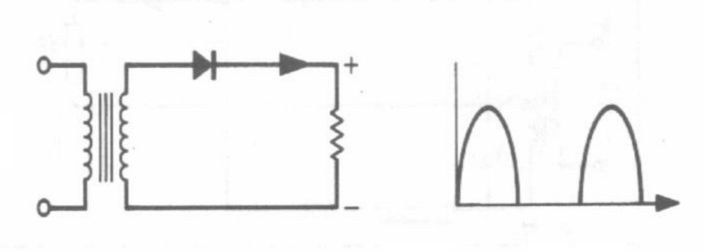

A. prostownik dwupołówkowy \
B. prostownik jednopołówkowy \
C. prostownik mostkowy dwupołówkowy

Odpowiedź: B. prostownik jednopołówkowy

Uzasadnienie:\
Prostownik służy do zamiany napięcia przemiennego na napięcie jednego znaku, które po dalszym odfiltrowaniu możeb yć zmienione na napięcie stałe.

Na rysunku możemy zauważyć, że nie prostownik nie posiada mostka, a dodatkowo rezultatem prostownika jest widoczna tylko jedna połówka okresu.

Referencja:\
https://pl.wikipedia.org/wiki/Prostownik

## 38.  Na rysunku przedstawiono schemat prostownika. Jak nazywa się ten rodzaj prostownika?

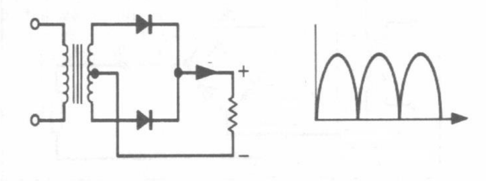

A. prostownik dwupołówkowy \
B. prostownik jednopołówkowy \
C. prostownik mostkowy dwupołówkowy

Odpowiedź: A. prostownik dwupołówkowy

Uzasadnienie:\
Na rysunku przedstawiono prostownik dwupołówkowy, gdyż nie posiada on mostka, a dodatkowo rezultatem prostownika są widoczne dwie połówki okresu.

Referencja:\
https://pl.wikipedia.org/wiki/Prostownik

## 39. Wzmacniacz wzmacnia sygnały w zakresie od 100Hz do 10 kHz. Wzmacniacz ten nazywamy wzmacniaczem:
A. niskiej częstotliwości \
B. wzmacniaczem pośredniej częstotliwości \
C. wzmacniaczem selektywnym

Odpowiedź: A. niskiej częstotliwości

Uzasadnienie:\
Według tabeli pasma fal radiowych, częstotliwości niskie to częśtotliwośc od 3[Hz] to 300[kHz], tak więc nasz zakres 100[Hz] - 10[kHz] idealnie mieści się w tym przedziale.

Zakresy częstotliwości:
1. Wzmacniacz niskiej częstotliwości:\
Zakres częstotliwości: Typowo obejmuje pasmo częstotliwości audio, które jest zazwyczaj określane jako 20 Hz do 20 kHz.

2. Wzmacniacz pośredniej częstotliwości (IF):\
Zakres częstotliwości: Zakres ten zależy od konkretnego układu odbiorczego, ale typowe wartości mogą obejmować 100 kHz do kilku MHz. Przykładem częstotliwości pośrednich mogą być 455 kHz, 10.7 MHz lub inne, stosowane w różnych aplikacjach radiowych i telewizyjnych.

3. Wzmacniacz selektywny (filtrowy):\
Zakres częstotliwości: Jest to węższy zakres niż wzmacniacze niskiej częstotliwości i pośredniej częstotliwości. Przykładowo, wzmacniacze selektywne mogą być zaprojektowane do pracy w określonych pasmach, takich jak:
- Pasmo AM (Amplitudy Modulacji) w radiu o zakresie od kilku kHz do kilkuset kHz.
- Pasmo FM (Frequency Modulation) w radiu o zakresie od kilku MHz do kilkudziesięciu MHz.
- Konkretne pasma częstotliwości w systemach telekomunikacyjnych, takich jak 2G, 3G, 4G, gdzie potrzebna jest selektywność w konkretnych częstotliwościach nośnych.

Referencja:\
https://pl.wikipedia.org/wiki/Fale_radiowe
https://www.elektroda.pl/rtvforum/topic3858626.html#19789957
https://zstio-elektronika.pl/pliki_t_elektronik/UA-wzmacniacze_selektywne-lekcja.pdf

## 40. Kiedy wzmacniacz jest przesterowany?
A. jak ma za duże napięcie zasilania \
B. jak ma za duże napięcie wejściowe \
C. jak pracuje w klasie C

Odpowiedź: B. jak ma za duże napięcie wejściowe

Uzasadnienie:\
Przesterowanie powstaje po podaniu zbyt dużego sygnału na wejście wzmacniacza. Wartość napięcia wyjściowego osiąga wtedy maksymalny możliwy poziom (nie może być więcej, ponieważ jest już np. zbliżone do napięcia zasilania). Przy dalszym zwiększaniu napięcia wejściowego, na wyjściu utrzymuje się stały poziom. W wyniku przesterowania z sygnału sinusoidalnego możemy otrzymać sygnał zbliżony do prostokątnego (obcięcie szczytów sinusa). Jest to bardzo niepożądane zjawisko we wzmacniaczach mocy wysokich częstotliwości i powoduje powstanie harmonicznych sygnału, co będzie powodowało zakłócenia.

Referencja:\
https://pl.wikipedia.org/wiki/Przesterowanie

## 41. W jakiej klasie ma pracować wzmacniacz rezonansowy w.cz. (wysokich częstotliwości) do wzmacniania sygnału SSB?
A. w klasie C \
B. w klasie AB \
C. impulsowo

Odpowiedź: B. w klasie AB

Uzasadnienie:\
Wzmacniacze emisji SSB i  AM są budowane w klasie AB (układy klasy B i C nie są stosowane, bo powodują zniekształcenia obwiedni i niepożądane emisje poza pasmem użytkowym), w  której prąd spoczynkowy elementu aktywnego jest niezerowy, a punkt pracy jest umieszczony na początku liniowego odcinka charakterystyki przejściowej tranzystora. Dzięki temu przy małym wysterowaniu wzmacniacz klasy AB pracuje w klasie A (prąd płynie przez cały okres. w. cz.), a przy dużym – w warunkach bliskich klasie B.

1. Klasa A:\
    Kojarzona jest z niskimi zniekształceniami jak i wysoką jakością dźwięku. Wadą takich układów jest jednak bardzo niska sprawność energetyczna (zwykle od kilku do kilkunastu procent), z czym wiąże się wysoka emisja ciepła. Wysokie są też koszty budowy takiego wzmacniacza (duży zasilacz, odpowiednie radiatory, aby ciepło sprawnie oddać do otoczenia, wreszcie potężna sekcja tranzystorów).

2. Klasa B:\
   Oznacza taką kalibrację, aby tranzystory (lampy) nie przewodziły prądu, gdy nie ma sygnału sterującego. Po pojawieniu się takiego sygnału elementy są włączane. Teoretycznie można układ zaprojektować w taki sposób, by utrzymywać go na granicy przewodzenia. W praktyce jest to jednak bardzo trudne, ponieważ skutkuje pojawieniem się znacznych zniekształceń. Sprawność takich rozwiązań może być wysoka (nawet 70-80%), ale ze względu na liczne problemy wzmacniaczy w klasie B właściwie się nie stosuje.

3. Wzmacniacze w klasie AB:\
    Bardzo popularne są natomiast wzmacniacze w klasie AB. W spoczynku przez elementy wyjściowe płynie prąd o nieznacznej wartości. Przy bardzo małych sygnałach wzmacniacz zachowuje się podobnie do wzmacniacza w klasie A, a przy dużych - jak w klasie B. Pozwala to uzyskać przyzwoitą sprawność (zwykle w okolicach 50-60 %) i niski poziom zniekształceń. Klasa AB to najczęstszy wybór większości konstruktorów wzmacniaczy liniowych.

4. Klasa C:\
   Ma sporo cech wspólnych z klasą B, przy braku sygnału sterującego elementy czynne nie przewodzą prądu, nie przewodzą go także w przypadku niskich sygnałów muzycznych. Co więcej, mocne wysterowanie wzmacniacza powoduje pojawienie się bardzo wysokich zniekształceń. Wzmacniacze w klasie C nie znalazły zastosowania w technice audio.

5. Klasa D:\
    Wzmacniacze w klasie D to konstrukcje z tzw. impulsowymi końcówkami mocy, złożonymi zwykle z baterii tranzystorów przełączanych ciągami impulsów (stąd potoczna nazwa), wysyłanymi z generatora. W przeciwieństwie do wzmacniaczy liniowych końcówki mocy nie są sterowane wprost sygnałem muzycznym, a jego pochodną, która powstaje w specjalnym, dodatkowym obwodzie modulatora. Wyróżniamy kilka typów modulatorów, najpopularniejszym jest PWM (modulator szerokości impulsu). Zaletą wzmacniaczy w klasie D jest bardzo wysoka sprawność, która sięga nawet 90%.

https://audio.com.pl/vademecum/faq/stereo-wzmacniacze/26241-jakie-sa-i-czym-sie-charakteryzuja-klasy-pracy-wzmacniacza \
https://ep.com.pl/files/11139.pdf

##  42. Na rysunku przedstawiono schemat stabilizacji PLL w formie ponumerowanych ale nie opisanych bloków. Blok 1 to:
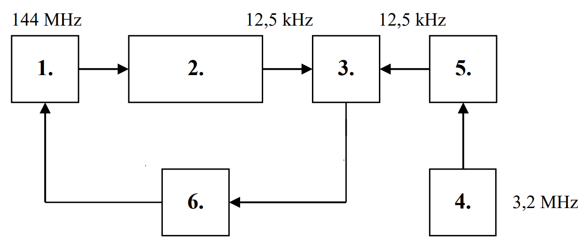

A. generator stabilizowany \
B. komparator \
C. dzielnik wzorca

Odpowiedź: A. generator stabilizowany

Uzasadnienie:

Czym jest synteza PLL w radiu?\
PLL (Phase-Locked Loop) to układ z zamkniętą pętlą fazową, który kontroluje częstotliwość sygnału wyjściowego tak, aby zawsze była synchronizowana z sygnałem referencyjnym. W kontekście radia, układy PLL są używane do precyzyjnego dostrojenia częstotliwości, co przekłada się na wyższą jakość odbioru sygnału.

Na rysunku widzimy:
1. Generator stabilizowany [np. sterowany napięciem (VCO - Voltage Controlled Oscillator)]:
   - Generuje sygnał o częstotliwości zależnej od napięcia sterującego. W tym przypadku częstotliwość wynosi 144 MHz.
    
2. Dzielnik nastawny (dzielnik częstotliwości):
   - Dzieli częstotliwość sygnału z VCO przez określoną liczbę, aby uzyskać sygnał o niższej częstotliwości (w tym przypadku 12,5 kHz).

3. Detektor (komparator) fazy:
    - Porównuje fazę sygnału z dzielnika częstotliwości z fazą sygnału odniesienia (12,5 kHz) i generuje sygnał błędu proporcjonalny do różnicy faz.
  
4. Generator wzorca (Generator częstotliwości wzorcowej):
    - Generuje sygnał referencyjny o stałej częstotliwości (3,2 MHz), który jest używany do synchronizacji w systemie PLL.

5. Dzielnik wzorca:
    - Dzieli częstotliwość sygnału z oscylatora referencyjnego do poziomu odpowiedniego dla porównania w detektorze fazy (12,5 kHz). W tym przypadku mamy sygnał referencyjny o częstotliwości 3,2 MHz (z Generatora wzorca [4]). Chcemy uzyskać sygnał o częstotliwości 12,5 kHz, musimy więc podzielić 3,2MHz przez 256. Dzielnik wzorca wykonuje dokładnie tę operację, zmniejszając pierwotną częstotliwość do pożądanej wartości.
    - Można zapytać, dlaczego potrzebujemy dzielnika wzorca zamiast użyć Generatora wzorca [4] o częstotliwości 12,5kHz. Jest kilka powodów:
      - Oscylatory referencyjne o wyższych częstotliwościach, takie jak 3,2 MHz, są zazwyczaj bardziej stabilne i precyzyjne niż te o niższych częstotliwościach. Zapewniają one lepszą dokładność i mniejszy dryf częstotliwości w czasie, co jest kluczowe dla stabilności układu PLL.
      - Sygnały o wyższych częstotliwościach mają mniejsze zakłócenia i szumy w porównaniu do sygnałów o niższych częstotliwościach. To oznacza, że sygnał referencyjny 3,2 MHz będzie czystszy i mniej podatny na zakłócenia niż sygnał 12,5 kHz.
      - Generator o wyższej częstotliwości, jak 3,2 MHz, może być podzielony na wiele różnych niższych częstotliwości za pomocą dzielników częstotliwości. To daje większą elastyczność w projektowaniu układów i umożliwia łatwe dostosowanie do różnych zastosowań.
    
6. Wzmacniacz błędu:
    - Wzmacniacz błędu potrzebny jest do zminimalizowania czasu reakcji układu na powstające błedy i natychmiastowego korygowania.

Referencja:\
https://youtu.be/W_x6KgO2co4?feature=shared&t=2905 \
https://youtu.be/CM8n3wzNOvc?feature=shared&t=420 \
https://pl.wikipedia.org/wiki/Generator_sterowany_napi%C4%99ciem \
https://pl.wikipedia.org/wiki/Dzielnik_cz%C4%99stotliwo%C5%9Bci \
https://pl.wikipedia.org/wiki/Detektor_fazy \
https://pl.wikipedia.org/wiki/Generator_cz%C4%99stotliwo%C5%9Bci_wzorcowej
https://www.elektroda.pl/rtvforum/topic405074.html
https://goodaudio.pl/blog/radia-z-synteza-pll-co-warto-wiedziec/

##  43. Na rysunku przedstawiono schemat stabilizacji PLL w formie ponumerowanych ale nie opisanych bloków. Blok 4 to:

A. dzielnik wzorca \
B. generator wzorca \
C. dzielnik wzorca

Odpowiedź: B. generator wzorca

Uzasadnienie:

Czym jest synteza PLL w radiu?\
PLL (Phase-Locked Loop) to układ z zamkniętą pętlą fazową, który kontroluje częstotliwość sygnału wyjściowego tak, aby zawsze była synchronizowana z sygnałem referencyjnym. W kontekście radia, układy PLL są używane do precyzyjnego dostrojenia częstotliwości, co przekłada się na wyższą jakość odbioru sygnału.

Na rysunku widzimy:
1. Generator stabilizowany [np. sterowany napięciem (VCO - Voltage Controlled Oscillator)]:
   - Generuje sygnał o częstotliwości zależnej od napięcia sterującego. W tym przypadku częstotliwość wynosi 144 MHz.
    
2. Dzielnik nastawny (dzielnik częstotliwości):
   - Dzieli częstotliwość sygnału z VCO przez określoną liczbę, aby uzyskać sygnał o niższej częstotliwości (w tym przypadku 12,5 kHz).

3. Detektor (komparator) fazy:
    - Porównuje fazę sygnału z dzielnika częstotliwości z fazą sygnału odniesienia (12,5 kHz) i generuje sygnał błędu proporcjonalny do różnicy faz.
  
4. Generator wzorca (Generator częstotliwości wzorcowej):
    - Generuje sygnał referencyjny o stałej częstotliwości (3,2 MHz), który jest używany do synchronizacji w systemie PLL.

5. Dzielnik wzorca:
    - Dzieli częstotliwość sygnału z oscylatora referencyjnego do poziomu odpowiedniego dla porównania w detektorze fazy (12,5 kHz). W tym przypadku mamy sygnał referencyjny o częstotliwości 3,2 MHz (z Generatora wzorca [4]). Chcemy uzyskać sygnał o częstotliwości 12,5 kHz, musimy więc podzielić 3,2MHz przez 256. Dzielnik wzorca wykonuje dokładnie tę operację, zmniejszając pierwotną częstotliwość do pożądanej wartości.
    - Można zapytać, dlaczego potrzebujemy dzielnika wzorca zamiast użyć Generatora wzorca [4] o częstotliwości 12,5kHz. Jest kilka powodów:
      - Oscylatory referencyjne o wyższych częstotliwościach, takie jak 3,2 MHz, są zazwyczaj bardziej stabilne i precyzyjne niż te o niższych częstotliwościach. Zapewniają one lepszą dokładność i mniejszy dryf częstotliwości w czasie, co jest kluczowe dla stabilności układu PLL.
      - Sygnały o wyższych częstotliwościach mają mniejsze zakłócenia i szumy w porównaniu do sygnałów o niższych częstotliwościach. To oznacza, że sygnał referencyjny 3,2 MHz będzie czystszy i mniej podatny na zakłócenia niż sygnał 12,5 kHz.
      - Generator o wyższej częstotliwości, jak 3,2 MHz, może być podzielony na wiele różnych niższych częstotliwości za pomocą dzielników częstotliwości. To daje większą elastyczność w projektowaniu układów i umożliwia łatwe dostosowanie do różnych zastosowań.
    
6. Wzmacniacz błędu:
    - Wzmacniacz błędu potrzebny jest do zminimalizowania czasu reakcji układu na powstające błedy i natychmiastowego korygowania.

Referencja:\
https://youtu.be/W_x6KgO2co4?feature=shared&t=2905 \
https://youtu.be/CM8n3wzNOvc?feature=shared&t=420 \
https://pl.wikipedia.org/wiki/Generator_sterowany_napi%C4%99ciem \
https://pl.wikipedia.org/wiki/Dzielnik_cz%C4%99stotliwo%C5%9Bci \
https://pl.wikipedia.org/wiki/Detektor_fazy \
https://pl.wikipedia.org/wiki/Generator_cz%C4%99stotliwo%C5%9Bci_wzorcowej
https://www.elektroda.pl/rtvforum/topic405074.html
https://goodaudio.pl/blog/radia-z-synteza-pll-co-warto-wiedziec/

##  44. Na rysunku przedstawiono schemat blokowy odbiornika bezpośredniego wzmocnienia z reakcją. Blok 3 to:

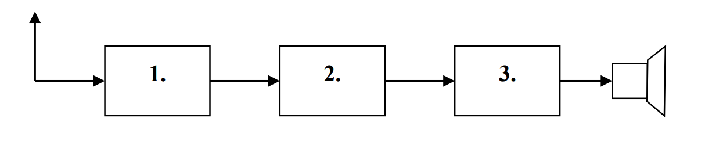

A. wzmacniacz akustyczny \
B. detektor z reakcją \
C. wzmacniacz w.cz

Odpowiedź: A. wzmacniacz akustyczny

Uzasadnienie:

Na rysunku widzimy:
1. wzmacniacz wysokich częstotliwości
2. detektor z reakcją
3. wzmacniacz akustyczny (wzmacniacz małych częstotliwości)

Odbiornikiem o wzmocnieniu bezpośrednim nazywamy taki odbiornik, w którym częstotliwość odbieranego sygnału nie ulega podczas wzmacniania żadnym zmianom, Oznacza to, że częstotliwość wzmocnionego sygnału, podawanego na stopień detekcyjny czyli na demodulator odbiornika, jest identyczna z częstotliwością sygnału wejściowego, indukowanego w obwodzie antenowym odbiornika. Fale elektromagnetyczne indukują w antenie odbiornika napięcie modulowane wielkiej częstotliwości. Sygnał wejściowy zostaje następnie zdetektowany (zdemodulowany) za pomocą lampy elektronowej triody lub pentody. Po detekcji napięcie m.cz. zasila słuchawki lub głośnik.

Referencja:\
https://youtu.be/W_x6KgO2co4?feature=shared&t=3156 \
http://www.control.slupsk.pl/audion/

## 45. Na rysunku przedstawiono schemat blokowy odbiornika superheterodynowego AM z pojedynczą przemianą. Blok 1 to:

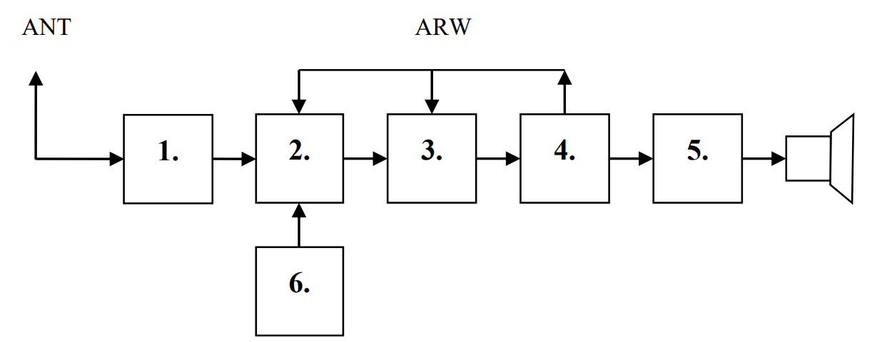

A. filtr wejściowy \
B. wzmacniacz akustyczny \
C. detektor AM

Odpowiedź: A. filtr wejściowy

Uzasadnienie:\
Odbiornik superheterodynowy to typ odbiornika radiowego, który przekształca sygnał wysokiej częstotliwości na sygnał o niższej, pośredniej częstotliwości, co ułatwia jego dalsze wzmacnianie i detekcję. Elementy podstawowego odbiornika superheterodynowego:
1. filtr wejściowy:
   - Sygnał wysokiej częstotliwości z anteny przechodzi przez wejściowy filtr, którego podstawowym zadaniem jest tłumienie tzw. częstotliwości lustrzanej.
2. mieszacz:
   - Przetwarza sygnał wejściowy o wysokiej częstotliwości na sygnał o pośredniej częstotliwości (IF). Działa poprzez mieszanie sygnału wejściowego z sygnałem generowanym przez heterodynę, co prowadzi do powstania sygnału różnicowego (o częstotliwości równej różnicy częstotliwości sygnałów wejściowych).
3. wzmacniacz/filtr pośredniej częstotliwości:
    - Wzmacnia sygnał o pośredniej częstotliwości uzyskany z mieszacza. Sygnał o pośredniej częstotliwości jest zwykle stabilniejszy i łatwiejszy do wzmocnienia, co pozwala na uzyskanie lepszej selektywności i czułości odbiornika.
4. detektor AM :
   - Wydobywa informację zmodulowaną (audio, wideo itp.) z sygnału o pośredniej częstotliwości. W przypadku odbiorników AM detektor demoduluje sygnał amplitudowo zmodulowany, a w przypadku odbiorników FM detektor demoduluje sygnał zmodulowany częstotliwościowo.
5. wzmacniacz akustyczny:
   - Wzmacnia sygnał audio (lub inny sygnał niskiej częstotliwości) uzyskany z detektora, aby mógł być wystarczająco silny do napędzania głośnika lub innych urządzeń końcowych.
6. heterodyna (generator lokalny):
   - Generuje sygnał o stałej częstotliwości, który jest mieszany z sygnałem wejściowym w mieszaczu. Częstotliwość heterodyny jest ustawiana w taki sposób, aby różnica między częstotliwością sygnału wejściowego a częstotliwością heterodyny była równa pośredniej częstotliwości.

  Odbiornik superheterodynowy jest najdoskonalszą odmianą układową odbiorników radiowych. Oczywiście może być rozbudowywany w stosunku do podanego schematu blokowego o dodatkowe stopnie - wzmacniacze w.cz. na wejściu, dodatkowe stopnie p.cz., dodatkowe układ m.cz., automatyki różnego rodzaju itp. Więcej informacji o odbiorze superheterodynowym jest w specjalnie poświęconym mu dziale superheterodyny.

Referencja:\
https://youtu.be/W_x6KgO2co4?feature=shared&t=3360 \
https://www.stareradia.pl/theory/circuits.html \
https://pl.wikipedia.org/wiki/Superheterodyna \
https://zpe.gov.pl/a/odbiorniki-radiowe/DaFCA2JnB

## 46. Na rysunku przedstawiono schemat blokowy odbiornika superheterodynowego AM z pojedynczą przemianą. Blok 5 to: 

A. heterodyna 
B. wzmacniacz akustyczny 
C. detektor AM

Odpowiedź: B. wzmacniacz akustyczny

Uzasadnienie:\
Odbiornik superheterodynowy to typ odbiornika radiowego, który przekształca sygnał wysokiej częstotliwości na sygnał o niższej, pośredniej częstotliwości, co ułatwia jego dalsze wzmacnianie i detekcję. Elementy podstawowego odbiornika superheterodynowego:
1. filtr wejściowy:
   - Sygnał wysokiej częstotliwości z anteny przechodzi przez wejściowy filtr, którego podstawowym zadaniem jest tłumienie tzw. częstotliwości lustrzanej.
2. mieszacz:
   - Przetwarza sygnał wejściowy o wysokiej częstotliwości na sygnał o pośredniej częstotliwości (IF). Działa poprzez mieszanie sygnału wejściowego z sygnałem generowanym przez heterodynę, co prowadzi do powstania sygnału różnicowego (o częstotliwości równej różnicy częstotliwości sygnałów wejściowych).
3. wzmacniacz/filtr pośredniej częstotliwości:
    - Wzmacnia sygnał o pośredniej częstotliwości uzyskany z mieszacza. Sygnał o pośredniej częstotliwości jest zwykle stabilniejszy i łatwiejszy do wzmocnienia, co pozwala na uzyskanie lepszej selektywności i czułości odbiornika.
4. detektor AM :
   - Wydobywa informację zmodulowaną (audio, wideo itp.) z sygnału o pośredniej częstotliwości. W przypadku odbiorników AM detektor demoduluje sygnał amplitudowo zmodulowany, a w przypadku odbiorników FM detektor demoduluje sygnał zmodulowany częstotliwościowo.
5. wzmacniacz akustyczny:
   - Wzmacnia sygnał audio (lub inny sygnał niskiej częstotliwości) uzyskany z detektora, aby mógł być wystarczająco silny do napędzania głośnika lub innych urządzeń końcowych.
6. heterodyna (generator lokalny):
   - Generuje sygnał o stałej częstotliwości, który jest mieszany z sygnałem wejściowym w mieszaczu. Częstotliwość heterodyny jest ustawiana w taki sposób, aby różnica między częstotliwością sygnału wejściowego a częstotliwością heterodyny była równa pośredniej częstotliwości.

  Odbiornik superheterodynowy jest najdoskonalszą odmianą układową odbiorników radiowych. Oczywiście może być rozbudowywany w stosunku do podanego schematu blokowego o dodatkowe stopnie - wzmacniacze w.cz. na wejściu, dodatkowe stopnie p.cz., dodatkowe układ m.cz., automatyki różnego rodzaju itp. Więcej informacji o odbiorze superheterodynowym jest w specjalnie poświęconym mu dziale superheterodyny.

Referencja:
https://youtu.be/W_x6KgO2co4?feature=shared&t=3360 \
https://www.stareradia.pl/theory/circuits.html \
https://pl.wikipedia.org/wiki/Superheterodyna \
https://zpe.gov.pl/a/odbiorniki-radiowe/DaFCA2JnB

## 47. Na rysunku przedstawiono schemat blokowy odbiornika superheterodynowego AM, CW, SSB z podwójną przemianą częstotliwości. Blok 1 to:

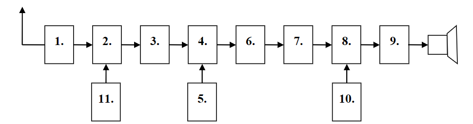

A. wzmacniacz w.cz. \
B. wzmacniacz akustyczny \
C. detektor AM CW SSB

Odpowiedź: A. wzmacniacz w.cz.

Uzasadnienie:\
Odbiornik superheterodynowy z dodatkowym stopniem pośredniej częstotliwości i dodatkowymi komponentami służy do bardziej precyzyjnego i elastycznego odbioru sygnałów radiowych. Na rysunku widzimy:

1. Wzmacniacz wielkiej częstotliwości (w.cz):
    - Wzmacnia sygnał radiowy odbierany przez antenę, poprawiając stosunek sygnału do szumu przed dalszym przetwarzaniem.
2. I mieszacz:
    - Miesza wzmocniony sygnał wejściowy z sygnałem pochodzącym z pierwszej heterodyny (11), tworząc sygnał o pierwszej pośredniej częstotliwości (I p.cz.).
3. Wzmacniacz I. pośredniej częstotliwości (I p.cz.):
    - Wzmacnia sygnał o pierwszej pośredniej częstotliwości, zwiększając jego poziom przed kolejnym mieszaniem.
4. II mieszacz:
    - Miesza wzmocniony sygnał I p.cz. z sygnałem pochodzącym z drugiej heterodyny (5), tworząc sygnał o drugiej pośredniej częstotliwości (II p.cz.).
5. II heterodyna stała:
    - Generuje sygnał o stałej częstotliwości, który jest używany przez drugi mieszacz do przekształcenia sygnału I p.cz. na sygnał II p.cz.
6. Filtr przełączany II p.cz.:
    - Selektuje odpowiedni pasmo sygnału o drugiej pośredniej częstotliwości, eliminując niepożądane sygnały i szumy.
7. Wzmacniacz II pośredniej częstotliwości (II p.cz.):
    - Dalsze wzmacnia sygnał po przejściu przez filtr, przygotowując go do detekcji.
8. Detektor AM, CW, SSB:
    - Demoduluje sygnał II p.cz. i wydobywa informacje zmodulowane. Może obsługiwać różne typy modulacji, takie jak AM (amplitudowa), CW (ciągła fala) i SSB (jednoboczna).
9. Wzmacniacz akustyczny:
    - Wzmacnia demodulowany sygnał audio, umożliwiając jego słyszalne odtwarzanie przez głośnik lub słuchawki.
10. Generator BFO (Beat Frequency Oscillator):
    - Generuje sygnał o częstotliwości zbliżonej do sygnału pośredniej częstotliwości, używany do demodulacji sygnałów CW i SSB poprzez tworzenie sygnału różnicowego.
11. I heterodyna strojona:
    - Generuje sygnał o zmiennej częstotliwości, który jest mieszany z sygnałem wejściowym w pierwszym mieszaczu. Strojenie heterodyny pozwala na odbiór różnych częstotliwości nadawczych.

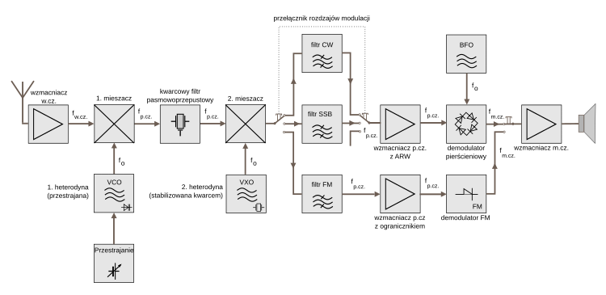

Referencja:\
https://youtu.be/W_x6KgO2co4?feature=shared&t=3510 \
https://youtu.be/iwJgoRB5FOk?feature=shared&t=830 \
https://pl.wikipedia.org/wiki/Superheterodyna \
https://pl.wikipedia.org/wiki/Superheterodyna#/media/Plik:Afu_superhet1_pl.svg

## 48. Na rysunku przedstawiono schemat blokowy odbiornika superheterodynowego AM, CW, SSB z podwójną przemianą częstotliwości. Blok 9 to:

A. wzmacniacz akustyczny \
B. wzmacniacz pośredniej cz. \
C. heterodyna

Odpowiedź: A. wzmacniacz akustyczny

Uzasadnienie:\
Odbiornik superheterodynowy z dodatkowym stopniem pośredniej częstotliwości i dodatkowymi komponentami służy do bardziej precyzyjnego i elastycznego odbioru sygnałów radiowych. Na rysunku widzimy:

1. Wzmacniacz wielkiej częstotliwości (w.cz):
    - Wzmacnia sygnał radiowy odbierany przez antenę, poprawiając stosunek sygnału do szumu przed dalszym przetwarzaniem.
2. I mieszacz:
    - Miesza wzmocniony sygnał wejściowy z sygnałem pochodzącym z pierwszej heterodyny (11), tworząc sygnał o pierwszej pośredniej częstotliwości (I p.cz.).
3. Wzmacniacz I. pośredniej częstotliwości (I p.cz.):
    - Wzmacnia sygnał o pierwszej pośredniej częstotliwości, zwiększając jego poziom przed kolejnym mieszaniem.
4. II mieszacz:
    - Miesza wzmocniony sygnał I p.cz. z sygnałem pochodzącym z drugiej heterodyny (5), tworząc sygnał o drugiej pośredniej częstotliwości (II p.cz.).
5. II heterodyna stała:
    - Generuje sygnał o stałej częstotliwości, który jest używany przez drugi mieszacz do przekształcenia sygnału I p.cz. na sygnał II p.cz.
6. Filtr przełączany II p.cz.:
    - Selektuje odpowiedni pasmo sygnału o drugiej pośredniej częstotliwości, eliminując niepożądane sygnały i szumy.
7. Wzmacniacz II pośredniej częstotliwości (II p.cz.):
    - Dalsze wzmacnia sygnał po przejściu przez filtr, przygotowując go do detekcji.
8. Detektor AM, CW, SSB:
    - Demoduluje sygnał II p.cz. i wydobywa informacje zmodulowane. Może obsługiwać różne typy modulacji, takie jak AM (amplitudowa), CW (ciągła fala) i SSB (jednoboczna).
9. Wzmacniacz akustyczny:
    - Wzmacnia demodulowany sygnał audio, umożliwiając jego słyszalne odtwarzanie przez głośnik lub słuchawki.
10. Generator BFO (Beat Frequency Oscillator):
    - Generuje sygnał o częstotliwości zbliżonej do sygnału pośredniej częstotliwości, używany do demodulacji sygnałów CW i SSB poprzez tworzenie sygnału różnicowego.
11. I heterodyna strojona:
    - Generuje sygnał o zmiennej częstotliwości, który jest mieszany z sygnałem wejściowym w pierwszym mieszaczu. Strojenie heterodyny pozwala na odbiór różnych częstotliwości nadawczych.

Referencja:\
https://youtu.be/W_x6KgO2co4?feature=shared&t=3510 \
https://youtu.be/iwJgoRB5FOk?feature=shared&t=830 \
https://pl.wikipedia.org/wiki/Superheterodyna \
https://pl.wikipedia.org/wiki/Superheterodyna#/media/Plik:Afu_superhet1_pl.svg

## 49. Na rysunku przedstawiono schemat blokowy odbiornika homodynowego CW i SSB, na jedno pasmo amatorskie. Blok 1 to:

A. filtr wejściowy \
B. wzmacniacz akustyczny \
C. heterodyna

Odpowiedź: A. filtr wejściowy

Uzasadnienie:\
Odbiornik homodynowy, zwany także odbiornikiem bezpośredniego przemieniania, przetwarza sygnał radiowy bez pośredniej częstotliwości, mieszając go bezpośrednio z sygnałem lokalnego oscylatora do pasma akustycznego. Na rysunku widzimy:
1. Filtr wejściowy:
    - Odfiltrowuje niepożądane częstotliwości z sygnału odbieranego przez antenę, pozwalając na przejście tylko sygnału o określonym pasmie częstotliwości, który ma być odbierany.
2. Mieszacz:
    - Miesza przefiltrowany sygnał wejściowy z sygnałem generowanym przez homodynę. W przeciwieństwie do odbiornika superheterodynowego, sygnał lokalnego oscylatora (homodyny) ma tę samą częstotliwość co sygnał wejściowy, co prowadzi do bezpośredniego przekształcenia sygnału RF na sygnał o niskiej częstotliwości (częstotliwości audio).
3. Wzmacniacz akustyczny:
    - Wzmacnia przekształcony sygnał o niskiej częstotliwości (audio), aby mógł być dostatecznie silny do odtwarzania przez głośnik lub inne urządzenie audio.
4. Homodyna (Local Oscillator):
    - Generuje sygnał lokalnego oscylatora, który jest używany w mieszaczu do bezpośredniego przemieniania częstotliwości. Częstotliwość homodyny jest równa częstotliwości odbieranego sygnału radiowego, co pozwala na bezpośrednie przekształcenie sygnału RF na sygnał audio.

Referencja:\
https://youtu.be/W_x6KgO2co4?feature=shared&t=3235 \
https://youtu.be/9xj7_Dl-JLc?feature=shared&t=735

## 50. Na rysunku przedstawiono schemat blokowy odbiornika superheterodynowego FM na pasmo 144 MHz z podwójną przemianą częstotliwości, pracującego w kanałach fonicznych, stabilizowany kwarcami. Blok 2 to:

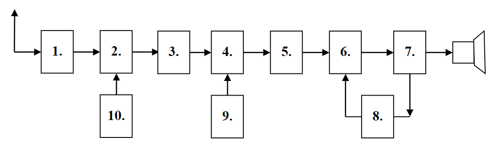

A. wzmacniacz akustyczny \
B. I mieszacz \
C. wzmacniacz II p.cz.

Odpowiedź: B. I mieszacz

Uzasadnienie:\
Odbiornik heterodynowy, będący szczególnym przypadkiem odbiornika superheterodynowego, przekształca sygnał radiowy na dwie pośrednie częstotliwości przed demodulacją. Na rysunku widzimy:
1. Wzmacniacz wielkiej częstotliwości (w.cz.):
    - Wzmacnia sygnał radiowy odbierany przez antenę, poprawiając stosunek sygnału do szumu przed dalszym przetwarzaniem.
2. I mieszacz:
    - Miesza wzmocniony sygnał wejściowy z sygnałem pochodzącym z pierwszej heterodyny kwarcowej (10), tworząc sygnał o pierwszej pośredniej częstotliwości (10,7 MHz).
3. Wzmacniacz I pośredniej częstotliwości (10,7 MHz):
    - Wzmacnia sygnał o pierwszej pośredniej częstotliwości, zwiększając jego poziom przed kolejnym mieszaniem.
4. II mieszacz:
    - Miesza wzmocniony sygnał I p.cz. (10,7 MHz) z sygnałem pochodzącym z drugiej heterodyny stałej (9), tworząc sygnał o drugiej pośredniej częstotliwości (455 kHz).
5. Wzmacniacz II pośredniej częstotliwości (455 kHz):
    - Dalsze wzmacnia sygnał po przejściu przez filtr, przygotowując go do detekcji.
6. Detektor FM:
    - Demoduluje sygnał FM o drugiej pośredniej częstotliwości, wydobywając informacje zmodulowane.
7. Wzmacniacz akustyczny:
    - Wzmacnia demodulowany sygnał audio, umożliwiając jego słyszalne odtwarzanie przez głośnik lub słuchawki.
8. Blokada szumów (Squelch):
    - Automatycznie wycisza odbiornik w przypadku braku użytecznego sygnału, eliminując szumy tła, gdy nie ma żadnego nadawanego sygnału.
9. II heterodyna stała:
    - Generuje sygnał o stałej częstotliwości (zwykle 10,245 MHz), który jest używany przez drugi mieszacz do przekształcenia sygnału I p.cz. (10,7 MHz) na sygnał II p.cz. (455 kHz).
10. I heterodyna kwarcowa:
    - Generuje sygnał o stałej częstotliwości, który jest mieszany z sygnałem wejściowym w pierwszym mieszaczu. Dzięki użyciu rezonatora kwarcowego, częstotliwość heterodyny jest bardzo stabilna i precyzyjna.

Referencja:\
https://youtu.be/W_x6KgO2co4?feature=shared&t=3770 \
https://youtu.be/iwJgoRB5FOk?feature=shared&t=830 \
https://pl.wikipedia.org/wiki/Superheterodyna \
https://pl.wikipedia.org/wiki/Superheterodyna#/media/Plik:Afu_superhet1_pl.svg \
https://www.eeeguide.com/communication-receiver-block-diagram/

## 51. Jaka powinna być stabilność heterodyny w odbiorniku komunikacyjnym? Częstotliwość heterodyny na najwyższym zakresie po włączeniu odbiornika powinna zmieniać się nie więcej jak: 
A. o 200 Hz \
B. o 500 Hz \
C. o 1000 Hz

Odpowiedź: A. o 200 Hz

Uzasadnienie:\
Stabilność heterodyny w odbiorniku komunikacyjnym jest kluczowym parametrem, ponieważ wpływa na dokładność odbioru sygnałów radiowych i ich demodulację. Zbyt duża zmiana częstotliwości heterodyny może prowadzić do zmiany pośredniej częstotliwości, co w konsekwencji może skutkować nieprawidłowym odbiorem lub nawet brakiem możliwości odbioru sygnału. Czyli im mniejsza częstotliwość heterodyny na najwyższym zakresie tym lepiej.

W odbiornikach komunikacyjnych, szczególnie tych wykorzystywanych w profesjonalnych zastosowaniach (np. w lotnictwie, służbach ratunkowych, amatorskich krótkofalowcach), wymagana jest wysoka stabilność częstotliwości heterodyny.

Odstrojenie się od nadawcy (a taki jest skutek dewiacji) o więcej niż 200 Hz (200 Hz uznaje się za częstotliwość graniczną) powoduje całkowitą nieczytelność mowy. Natomiast w przypadku CW takie odstrojenie może powodować zanikanie sygnału (odbiór poza pasmem nadawania sygnału).

Referencja:\
https://forums.qrz.com/index.php?threads/arrl-readies-bandwidth-recommendations.64376/ \
http://www.rudolf.net.pl/sp9kat/wp-content/uploads/2012/08/odpowiedzi-kf-calosc.pdf \
https://piotr-gorecki.pl/br025-filtry-aktywne-czesc-1/ \
https://pl.wikipedia.org/wiki/Cz%C4%99stotliwo%C5%9B%C4%87_graniczna_filtru

## 52. Na rysunku przedstawiono schemat blokowy nadajnika telegraficznego na jedno pasmo amatorskie. Blok 4 to: 

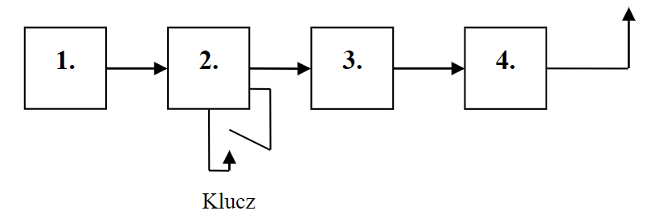

A. filtr wyjściowy \
B. wzmacniacz mocy (PA) \
C. separator

Odpowiedź: A. filtr wyjściowy

Uzasadnienie:
1. oscylator (VFO):
    - Oscylator generuje sygnał o określonej częstotliwości. Jest to podstawowe źródło sygnału dla całego nadajnika. Częstotliwość wyjściowa oscylatora może być regulowana, aby nadajnik mógł pracować na różnych częstotliwościach.
    - Możemy go porównać do gwizdka, który można dostroić, aby wydawał różne dźwięki. W nadajniku telegraficznym oscylator tworzy sygnał, który będziemy wysyłać.
2. separator:
   - Separator oddziela sygnał oscylatora od reszty układu, co zapobiega wpływowi zmian w dalszych częściach nadajnika na stabilność i częstotliwość generowanego sygnału. Separator pełni również funkcję wzmocnienia sygnału, przygotowując go do dalszego przetwarzania.
   - Separator działa jak tłumik dźwięku w instrumentach muzycznych. Oddziela on sygnał oscylatora od reszty układu, aby zapewnić, że ten dźwięk (sygnał) pozostaje czysty i nie jest zakłócony przez inne części nadajnika. Separator również trochę wzmacnia ten sygnał, aby był bardziej słyszalny.
   - Klucz to przełącznik, który pozwala na włączanie i wyłączanie sygnału. W telegrafii używa się go do tworzenia kodu Morse'a, gdzie krótkie i długie sygnały (kreski i kropki) reprezentują różne litery i cyfry.
3. wzmacniacz mocy (PA):
   - Wzmacniacz mocy zwiększa moc sygnału do poziomu wymaganego do skutecznego nadawania. Jest to konieczne, aby sygnał mógł być przesyłany na większe odległości i był odbierany przez odbiornik z odpowiednią siłą.
   - Wzmacniacz mocy to jak megafon dla naszego sygnału. Zwiększa on moc (głośność) sygnału, aby ten mógł być wysłany na dużą odległość i dobrze słyszany przez odbiornik.
4. filtr wyjściowy:
   - Filtr wyjściowy usuwa niepożądane składowe częstotliwościowe z sygnału wyjściowego. Chroni to przed zakłóceniami w innych urządzeniach elektronicznych i zapewnia czystość sygnału nadawanego na określonej częstotliwości.
   - Filtr wyjściowy działa jak sito, które przepuszcza tylko czyste dźwięki. Usuwa on wszelkie niepożądane dźwięki (zakłócenia), aby sygnał wysyłany przez nadajnik był czysty i nie przeszkadzał innym urządzeniom.

Referencja:\
https://youtu.be/W_x6KgO2co4?feature=shared&t=4335 \
https://sq9jdo.com.pl/Kurs%20krotkofalarski/3/z_05.html

## 53. Na rysunku przedstawiono schemat blokowy nadajnika telegraficznego na kilka pasm amatorskich z powielaniem częstotliwości. Blok 1 to: 

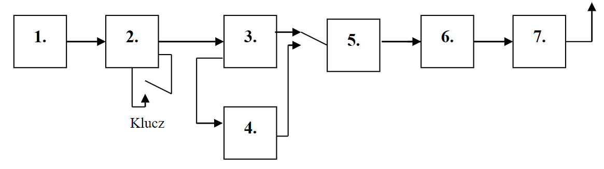

A. wzmacniacz mocy (PA) \
B. oscylator (VFO) \
C. separator

Odpowiedź: B. oscylator (VFO)

Uzasadnienie:
1. oscylator (VFO):
    - Oscylator generuje sygnał o określonej częstotliwości. Jest to podstawowe źródło sygnału dla całego nadajnika. Częstotliwość wyjściowa oscylatora może być regulowana, aby nadajnik mógł pracować na różnych częstotliwościach.
    - Możemy go porównać do gwizdka, który można dostroić, aby wydawał różne dźwięki. W nadajniku telegraficznym oscylator tworzy sygnał, który będziemy wysyłać.
2. separator:
   - Separator oddziela sygnał oscylatora od reszty układu, co zapobiega wpływowi zmian w dalszych częściach nadajnika na stabilność i częstotliwość generowanego sygnału. Separator pełni również funkcję wzmocnienia sygnału, przygotowując go do dalszego przetwarzania.
   - Separator działa jak tłumik dźwięku w instrumentach muzycznych. Oddziela on sygnał oscylatora od reszty układu, aby zapewnić, że ten dźwięk (sygnał) pozostaje czysty i nie jest zakłócony przez inne części nadajnika. Separator również trochę wzmacnia ten sygnał, aby był bardziej słyszalny.
   - Klucz to przełącznik, który pozwala na włączanie i wyłączanie sygnału. W telegrafii używa się go do tworzenia kodu Morse'a, gdzie krótkie i długie sygnały (kreski i kropki) reprezentują różne litery i cyfry.
3. I powielacz x2:
   - Podwaja ton dźwięku. Jeśli oscylator tworzy dźwięk o pewnym tonie, to po przejściu przez ten powielacz ton staje się dwa razy wyższy.
   - Dlaczego są używane: W praktyce trudno jest zbudować stabilny oscylator, który generuje sygnał bezpośrednio na bardzo wysokich częstotliwościach z odpowiednią stabilnością i czystością. Generowanie sygnału na niższej częstotliwości i jego powielanie jest technicznie łatwiejsze i bardziej stabilne. Powielanie częstotliwości pozwala również na uzyskanie częstotliwości, które są wielokrotnościami pierwotnego sygnału, co jest szczególnie użyteczne w nadajnikach wielopasmowych.
4. II powielacz x2:
   - Podwaja ton dźwięku. Jeśli oscylator tworzy dźwięk o pewnym tonie, to po przejściu przez ten powielacz ton staje się dwa razy wyższy.
   - Dlaczego są używane: W praktyce trudno jest zbudować stabilny oscylator, który generuje sygnał bezpośrednio na bardzo wysokich częstotliwościach z odpowiednią stabilnością i czystością. Generowanie sygnału na niższej częstotliwości i jego powielanie jest technicznie łatwiejsze i bardziej stabilne. Powielanie częstotliwości pozwala również na uzyskanie częstotliwości, które są wielokrotnościami pierwotnego sygnału, co jest szczególnie użyteczne w nadajnikach wielopasmowych.
5. wzmacniacz sterujący:
   - Działa jak przedwzmacniacz, który wzmacnia dźwięk do poziomu odpowiedniego dla większego wzmacniacza. Przygotowuje dźwięk, aby mógł być jeszcze bardziej wzmocniony.
   - Dlaczego są używane: Sygnał pochodzący z powielaczy (lub innych bloków) może być zbyt słaby, aby bezpośrednio sterować wzmacniaczem mocy. Wzmacniacze sterujące zwiększają moc sygnału do poziomu, który jest wystarczający do efektywnego napędzania wzmacniacza mocy. To etapowe wzmacnianie sygnału zapewnia lepszą kontrolę nad jakością i stabilnością sygnału w całym torze nadajnika.
6. wzmacniacz mocy (PA):
   - Wzmacniacz mocy zwiększa moc sygnału do poziomu wymaganego do skutecznego nadawania. Jest to konieczne, aby sygnał mógł być przesyłany na większe odległości i był odbierany przez odbiornik z odpowiednią siłą.
   - Wzmacniacz mocy to jak megafon dla naszego sygnału. Zwiększa on moc (głośność) sygnału, aby ten mógł być wysłany na dużą odległość i dobrze słyszany przez odbiornik.
7. filtr wyjściowy:
   - Filtr wyjściowy usuwa niepożądane składowe częstotliwościowe z sygnału wyjściowego. Chroni to przed zakłóceniami w innych urządzeniach elektronicznych i zapewnia czystość sygnału nadawanego na określonej częstotliwości.
   - Filtr wyjściowy działa jak sito, które przepuszcza tylko czyste dźwięki. Usuwa on wszelkie niepożądane dźwięki (zakłócenia), aby sygnał wysyłany przez nadajnik był czysty i nie przeszkadzał innym urządzeniom.

Referencja:\
https://youtu.be/W_x6KgO2co4?feature=shared&t=4440

## 54. Na rysunku przedstawiono schemat blokowy nadajnika SSB na dwa pasma amatorskie z wzbudnicą 9 MHz. Blok 1 to:

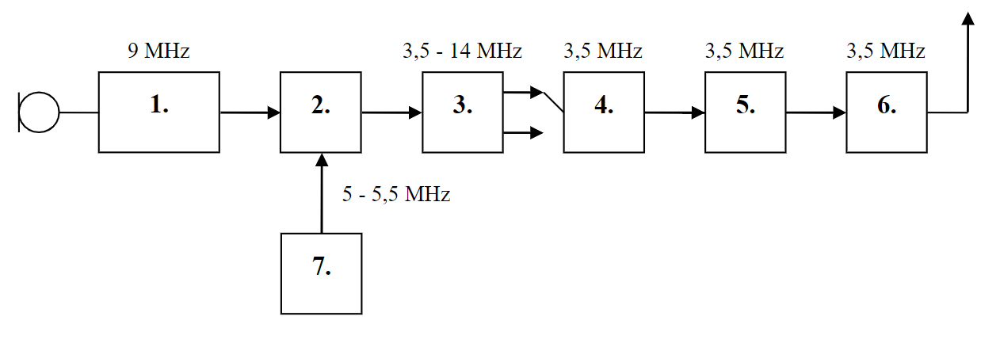
  
A. wzmacniacz mocy (PA)\
B. oscylator (VFO) 5 - 5.5 MHz\
C. wzbudnica SSB 9 MHz

Odpowiedź: C. wzbudnica SSB 9 MHz

Uzasadnienie:
1. wzbudnica SSB 9MHz:
   - Generuje sygnał SSB na częstotliwości 9 MHz. Wzbudnica (lub generator SSB) przetwarza sygnał audio na sygnał o wąskim paśmie, eliminując jedną z wstęg bocznych oraz sygnał nośny, co redukuje szerokość pasma i zwiększa efektywność transmisji.
2. mieszacz:
   - Miesza sygnał SSB z sygnałem z oscylatora zmiennej częstotliwości (VFO) w zakresie 5 - 5,5 MHz. Wynikiem tego procesu jest sygnał o nowej częstotliwości, która jest sumą lub różnicą częstotliwości wejściowych. Dzięki temu uzyskujemy sygnały na częstotliwościach 14-14,5 MHz (sumowanie) lub 3,5-4 MHz (różnicowanie).
3. filtr pasmowy 3,5 - 14MHz
   - Przepuszcza tylko pożądane pasmo częstotliwości (3,5-4 MHz lub 14-14,5 MHz), eliminując niechciane sygnały powstałe w procesie mieszania. Filtr ten pozwala na wybór pasma, na którym nadajnik ma pracować.
4. wzmacniacz sterujący
   - Wzmacnia sygnał pochodzący z filtra pasmowego do poziomu wystarczającego do sterowania wzmacniaczem mocy (PA). Wzmacniacz sterujący zapewnia odpowiedni poziom sygnału wejściowego dla następnego etapu wzmacniania.
5. wzmacniacz mocy (PA):
   - Wzmacnia sygnał do mocy wymaganej dla efektywnej transmisji. Wzmacniacz mocy zwiększa siłę sygnału do poziomu, który jest odpowiedni do przesyłania na dużą odległość przez antenę.
6. filtr wyjściowy:
   - Oczyszcza wzmocniony sygnał z niepożądanych harmonicznych i zakłóceń, zapewniając, że tylko czysty sygnał w pożądanym paśmie jest przekazywany do anteny. Filtr wyjściowy jest kluczowy dla spełnienia wymagań dotyczących emisji sygnałów radiowych i minimalizacji zakłóceń w sąsiednich pasmach.
7. oscylator (VFO) 5 - 5.5MHz:
   - Generuje sygnał o zmiennej częstotliwości w zakresie 5 - 5,5 MHz, który jest używany w mieszaczu do konwersji częstotliwości. VFO (Variable Frequency Oscillator) pozwala na precyzyjne strojenie nadajnika do pożądanej częstotliwości pracy w ramach wybranych pasm amatorskich.
 
Referencja:\
https://youtu.be/W_x6KgO2co4?feature=shared&t=4695

## 55. Na rysunku przedstawiono schemat blokowy nadajnika SSB na dwa pasma amatorskie z wzbudnicą 9 MHz. Blok 2 to:

  
A. wzmacniacz sterujący 
B. mieszacz 
C. filtr wyjściowy

Odpowiedź: B. mieszacz

Uzasadnienie:
1. wzbudnica SSB 9MHz:
   - Generuje sygnał SSB na częstotliwości 9 MHz. Wzbudnica (lub generator SSB) przetwarza sygnał audio na sygnał o wąskim paśmie, eliminując jedną z wstęg bocznych oraz sygnał nośny, co redukuje szerokość pasma i zwiększa efektywność transmisji.
2. mieszacz:
   - Miesza sygnał SSB z sygnałem z oscylatora zmiennej częstotliwości (VFO) w zakresie 5 - 5,5 MHz. Wynikiem tego procesu jest sygnał o nowej częstotliwości, która jest sumą lub różnicą częstotliwości wejściowych. Dzięki temu uzyskujemy sygnały na częstotliwościach 14-14,5 MHz (sumowanie) lub 3,5-4 MHz (różnicowanie).
3. filtr pasmowy 3,5 - 14MHz
   - Przepuszcza tylko pożądane pasmo częstotliwości (3,5-4 MHz lub 14-14,5 MHz), eliminując niechciane sygnały powstałe w procesie mieszania. Filtr ten pozwala na wybór pasma, na którym nadajnik ma pracować.
4. wzmacniacz sterujący
   - Wzmacnia sygnał pochodzący z filtra pasmowego do poziomu wystarczającego do sterowania wzmacniaczem mocy (PA). Wzmacniacz sterujący zapewnia odpowiedni poziom sygnału wejściowego dla następnego etapu wzmacniania.
5. wzmacniacz mocy (PA):
   - Wzmacnia sygnał do mocy wymaganej dla efektywnej transmisji. Wzmacniacz mocy zwiększa siłę sygnału do poziomu, który jest odpowiedni do przesyłania na dużą odległość przez antenę.
6. filtr wyjściowy:
   - Oczyszcza wzmocniony sygnał z niepożądanych harmonicznych i zakłóceń, zapewniając, że tylko czysty sygnał w pożądanym paśmie jest przekazywany do anteny. Filtr wyjściowy jest kluczowy dla spełnienia wymagań dotyczących emisji sygnałów radiowych i minimalizacji zakłóceń w sąsiednich pasmach.
7. oscylator (VFO) 5 - 5.5MHz:
   - Generuje sygnał o zmiennej częstotliwości w zakresie 5 - 5,5 MHz, który jest używany w mieszaczu do konwersji częstotliwości. VFO (Variable Frequency Oscillator) pozwala na precyzyjne strojenie nadajnika do pożądanej częstotliwości pracy w ramach wybranych pasm amatorskich.
 
Referencja:\
https://youtu.be/W_x6KgO2co4?feature=shared&t=4695

## 56. Na rysunku przedstawiono schemat blokowy nadajnika UKF na pasmo 144MHz z powielaniem częstotliwości kanałowego generatora kwarcowego 8 MHz. Blok 1 to:

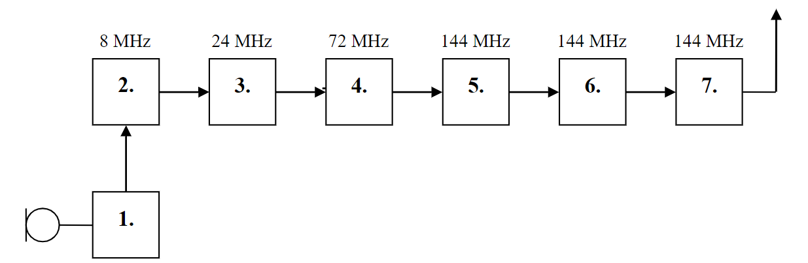

A. wzmacniacz mocy (PA) \
B. generator kwarcowy modulowany \
C. modulator 

Odpowiedź: C. modulator

Uzasadnienie:
1. modulator:
   - To urządzenie, które przygotowuje sygnał, który chcesz wysłać (np. głos lub muzykę), zmieniając sposób, w jaki sygnał radiowy się zachowuje.
2. generator kwarcowy modulowany:
   - To serce nadajnika. Wytwarza bardzo stabilny sygnał radiowy na niskiej częstotliwości i zmienia go w rytm sygnału z modulatora (czyli głosu lub muzyki).
3. I powielacz x3:
   - Ten element zwiększa częstotliwość sygnału trzy razy. Zaczynając od 8MHz otrzymujemy 24MHz.
4. II powielacz x3:
   - Ten element zwiększa częstotliwość sygnału trzy razy. Zaczynając od 24MHz otrzymujemy 72MHz.
5. III powielacz x2
   - Ten element zwiększa częstotliwość sygnału trzy razy. Zaczynając od 72MHz otrzymujemy 144MHz.
6. wzmacniacz mocy PA:
   - Wzmacnia sygnał, aby był wystarczająco silny do przesyłania na dużą odległość.
7. filtr wyjściowy:
   - Usuwa niepożądane sygnały i zakłócenia, pozostawiając tylko czysty sygnał radiowy na 144 MHz, który idzie do anteny i jest wysyłany w eter.

Referencja:\
https://youtu.be/W_x6KgO2co4?feature=shared&t=4940

## 57. Na rysunku przedstawiono schemat blokowy nadajnika UKF na pasmo 144MHz z powielaniem częstotliwości kanałowego generatora kwarcowego 8 MHz. Blok 7 to: 

A. modulator \
B. filtr wyjściowy \
C. I powielacz x 3

Odpowiedź: B. filtr wyjściowy

Uzasadnienie:
1. modulator:
   - To urządzenie, które przygotowuje sygnał, który chcesz wysłać (np. głos lub muzykę), zmieniając sposób, w jaki sygnał radiowy się zachowuje.
2. generator kwarcowy modulowany:
   - To serce nadajnika. Wytwarza bardzo stabilny sygnał radiowy na niskiej częstotliwości i zmienia go w rytm sygnału z modulatora (czyli głosu lub muzyki).
3. I powielacz x3:
   - Ten element zwiększa częstotliwość sygnału trzy razy. Zaczynając od 8MHz otrzymujemy 24MHz.
4. II powielacz x3:
   - Ten element zwiększa częstotliwość sygnału trzy razy. Zaczynając od 24MHz otrzymujemy 72MHz.
5. III powielacz x2
   - Ten element zwiększa częstotliwość sygnału trzy razy. Zaczynając od 72MHz otrzymujemy 144MHz.
6. wzmacniacz mocy PA:
   - Wzmacnia sygnał, aby był wystarczająco silny do przesyłania na dużą odległość.
7. filtr wyjściowy:
   - Usuwa niepożądane sygnały i zakłócenia, pozostawiając tylko czysty sygnał radiowy na 144 MHz, który idzie do anteny i jest wysyłany w eter.

Referencja:\
https://youtu.be/W_x6KgO2co4?feature=shared&t=4940

## 58. Jaka jest horyzontalna charakterystyka promieniowania dipola półfalowego zawieszonego poziomo? 

A. dookólna \
B. ósemkowa \
C. kierunkowa w linii zawieszenia

Odpowiedź: B. ósemkowa

Uzasadnienie:\
Dipol półfalowy zawieszony poziomo emituje najwięcej energii w kierunkach prostopadłych do osi dipola, a najmniej wzdłuż osi dipola. Charakterystyka promieniowania przypomina kształt cyfry "8", z dwoma głównymi płatami promieniowania.

Referencja:\
https://youtu.be/rDP16pDwIWc?feature=shared&t=3561 \
https://www.elektroda.pl/rtvforum/topic3311225.html#16299650 \
http://www.swiatradio.com.pl/virtual/download_2/anteny-kr_1.pdf [Anteny elektryczne / str. 20]

59. Jaka jest horyzontalna charakterystyka promieniowania pionowej anteny ćwierćfalowej? 
A. dookólna \
B. kierunkowa \
C. w kształcie koniczyny

Odpowiedź: A. dookólna

Uzasadnienie:\
Charakterystyka promieniowania w płaszczyźnie poziomej (czyli horyzontalnej) ma tendencję do bycia dookólną. Oznacza to, że promieniowanie jest emitowane w sposób zbliżony do okręgu wokół anteny, co wynika z symetrii anteny i jej właściwości elektromagnetycznych.
Antena ćwierćfalowa generuje promieniowanie, które jest najbardziej intensywne w kierunkach horyzontalnych, a mniej efektywne w kierunku pionowym. W związku z tym jej charakterystyka w płaszczyźnie poziomej przypomina okrąg, co jest zgodne z dookólną charakterystyką promieniowania.
W rzeczywistości, w płaszczyźnie poziomej charakterystyka promieniowania anteny ćwierćfalowej przypomina nieco kształt torusa (pierścienia) z minimalnymi wartościami w kierunkach osiowych (czyli w kierunku anteny). Jednakże w uproszczeniu, jest to opisane jako dookólne promieniowanie w płaszczyźnie poziomej.

Referencja:\
http://datasheets.pl/pdf/Anteny_amatorskiego_pasma_144-146_MHz.pdf [Antena GP (ćwierćfalowa)]\
https://www.radmor.com.pl/pl_files_to_download/portfolio/civil/KK-30829.pdf